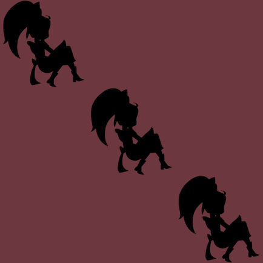

{{LearnSidebar}}{{PreviousMenu("Learn/JavaScript/Asynchronous/Introducing_workers", "Learn/JavaScript/Asynchronous")}}

이 평가에서는 일련의 애니메이션을 순서대로 재생하도록 페이지를 업데이트합니다. 이를 위해 [프로미스 사용 방법](/ko/docs/Learn/JavaScript/Asynchronous/Promises) 문서에서 배운 몇 가지 기술을 사용할 것입니다.

<table>
  <tbody>
    <tr>
      <th scope="row">사전 요구 사항:</th>
      <td>
        기본적인 컴퓨터 활용 능력, 자바스크립트 기본 사항에 대한 합리적인 이해, 프로미스 기반 API 사용 방법.
      </td>
    </tr>
    <tr>
      <th scope="row">목표:</th>
      <td>프로미스 기반 API를 사용하는 방법에 대한 이해를 테스트합니다.</td>
    </tr>
  </tbody>
</table>

## 시작 지점

<https://github.com/mdn/learning-area/tree/main/javascript/asynchronous/sequencing-animations/start> 에서 파일의 로컬 복사본을 만듭니다. 여기에는 4개의 파일이 포함되어 있습니다:

- alice.svg
- index.html
- main.js
- style.css

편집해야 하는 유일한 파일은 "main.js"입니다.

브라우저에서 "index.html"을 열면 세 개의 이미지가 대각선으로 정렬된 것을 볼 수 있습니다:



이미지는 [웹 애니메이션 API 사용](/ko/docs/Web/API/Web_Animations_API/Using_the_Web_Animations_API) 가이드에서 가져온 것입니다.

## 프로젝트 개요

이 페이지를 업데이트하여 세 개의 이미지 모두에 애니메이션을 차례로 적용하려고 합니다. 첫 번째 이미지가 완성되면 두 번째 이미지에 애니메이션을 적용하고, 두 번째 이미지가 완성되면 세 번째 이미지에 애니메이션을 적용하는 방식입니다.

애니메이션은 이미 "main.js"에 정의되어 있습니다. 이미지를 회전하고 사라질 때까지 축소하기만 하면 됩니다.

페이지가 어떻게 작동하는지 더 자세히 알아보려면 [완성된 예제를 살펴보세요](https://mdn.github.io/learning-area/javascript/asynchronous/sequencing-animations/finished/). 애니메이션은 한 번만 실행되므로 애니메이션을 다시 보려면 페이지를 새로고침하세요.

## 완료 단계

### 첫 번째 이미지에 애니메이션 적용

이미지에 애니메이션을 적용하기 위해 [웹 애니메이션 API](/ko/docs/Web/API/Web_Animations_API), 특히 {{domxref("Element/animate", "element.animate()")}} 메서드를 사용하고 있습니다.

다음과 같이 "main.js"를 업데이트하여 `alice1.animate()` 호출을 추가합니다:

```js
const aliceTumbling = [
  { transform: "rotate(0) scale(1)" },
  { transform: "rotate(360deg) scale(0)" },
];

const aliceTiming = {
  duration: 2000,
  iterations: 1,
  fill: "forwards",
};

const alice1 = document.querySelector("#alice1");
const alice2 = document.querySelector("#alice2");
const alice3 = document.querySelector("#alice3");

alice1.animate(aliceTumbling, aliceTiming);
```

페이지를 새로고침하면 첫 번째 이미지가 회전 및 축소되는 것을 볼 수 있습니다.

### 모든 이미지에 애니메이션 적용

다음으로, `alice1`이 끝나면 `alice2`에 애니메이션을 적용하고 `alice2`가 끝나면 `alice3`에 애니메이션을 적용하겠습니다.

`animate()` 메서드는 {{domxref("Animation")}} 객체를 반환합니다. 이 객체에는 애니메이션 재생이 완료되면 이행되는 `Promise`인 `finished` 프로퍼티가 있습니다. 따라서 이 프로미스를 사용하여 다음 애니메이션을 언제 시작할지 알 수 있습니다.

프로미스를 사용하는 다양한 방법을 강화하기 위해 이를 구현하는 몇 가지 다른 방법을 시도해 보시기 바랍니다.

1. 먼저, [콜백 사용에 대한 논의](/ko/docs/Learn/JavaScript/Asynchronous/Introducing#callbacks) 에서 보았던 "콜백 지옥" 문제의 프로미스 버전이 있지만 작동하는 것을 구현합니다.

2. 다음으로, 이를 [프로미스 체인](/ko/docs/Learn/JavaScript/Asynchronous/Promises#chaining_promises) 으로 구현합니다. [화살표 함수](/ko/docs/Learn/JavaScript/Building_blocks/Functions#arrow_functions) 에 사용할 수 있는 형태가 다양하기 때문에 이를 작성할 수 있는 몇 가지 다른 방법이 있다는 점에 유의하세요. 몇 가지 다른 형태를 시도해 보세요. 어떤 것이 가장 간결할까요? 어떤 것이 가장 가독성이 높다고 생각하시나요?

3. 마지막으로 [`async` 와 `await`](/ko/docs/Learn/JavaScript/Asynchronous/Promises#async_and_await) 를 사용해 구현합니다.

`element.animate()`는 `Promise`를 반환하는 것이 아니라 `Promise`인 `finished` 프로퍼티를 가진 `Animation` 객체를 반환한다는 점을 기억하세요.

## 평가 또는 추가 도움말

작업 평가를 받고 싶거나 막혀서 도움을 요청하고 싶은 경우:

1. [CodePen](https://codepen.io/), [jsFiddle](https://jsfiddle.net/) 또는 [Glitch](https://glitch.com/) 와 같은 공유 가능한 온라인 편집기에 작업을 넣습니다.
2. [MDN 담론 포럼 학습 카테고리](https://discourse.mozilla.org/c/mdn/learn/250) 에서 평가 및/또는 도움을 요청하는 게시물을 작성합니다. 게시물에는 다음이 포함되어야 합니다:

   - "애니메이션 시퀀싱에 대한 평가 필요" 등의 설명이 포함된 제목.
   - 이미 시도한 내용, 막혀서 도움이 필요하거나 평가가 필요한 경우와 같이 당사에 바라는 사항에 대한 세부 정보.
   - 온라인 공유 가능한 편집기에서 평가받거나 도움이 필요한 예제에 대한 링크(위 1단계에서 설명한 대로). 코드를 볼 수 없다면 코딩 문제가 있는 사람을 도와주기가 매우 어렵기 때문에 이 방법을 사용하는 것이 좋습니다.
   - 실제 과제 또는 평가 페이지로 연결되는 링크를 통해 도움을 원하는 문제를 찾을 수 있습니다.

{{PreviousMenu("Learn/JavaScript/Asynchronous/Introducing_workers", "Learn/JavaScript/Asynchronous")}}
