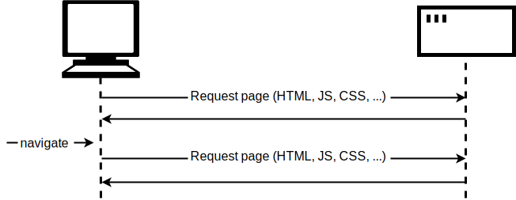
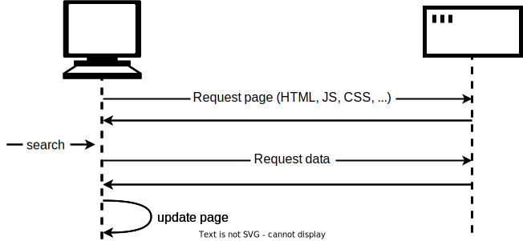
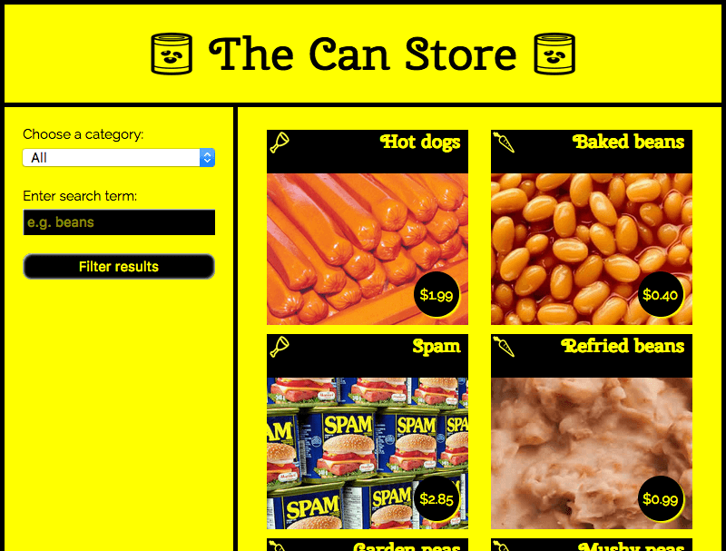

{{LearnSidebar}}{{PreviousMenuNext("Learn/JavaScript/Client-side_web_APIs/Manipulating_documents", "Learn/JavaScript/Client-side_web_APIs/Third_party_APIs", "Learn/JavaScript/Client-side_web_APIs")}}

최신 웹사이트와 애플리케이션의 또 다른 매우 일반적인 작업은 전체 새 페이지를 로드하지 않고도 서버에서 개별 데이터 항목을 검색하여 웹페이지의 섹션을 업데이트하는 것입니다. 사소해 보이는 이 작업은 사이트의 성능과 동작에 큰 영향을 미치므로 이 글에서는 개념을 설명하고 이를 가능하게 하는 기술, 특히 [Fetch API](/ko/docs/Web/API/Fetch_API) 에 대해 살펴보겠습니다.

<table>
  <tbody>
    <tr>
      <th scope="row">사전 요구 사항:</th>
      <td>
        JavaScript 기초(
        <a href="/ko/docs/Learn/JavaScript/First_steps">첫 번째 단계</a>,
        <a href="/ko/docs/Learn/JavaScript/Building_blocks"
          >빌딩 블록</a
        >,
        <a href="/ko/docs/Learn/JavaScript/Objects">JavaScript 객체</a> 참조), <a href="/ko/docs/Learn/JavaScript/Client-side_web_APIs/Introduction"
          >클라이언트 측 API의 기본 사항</a
        >
      </td>
    </tr>
    <tr>
      <th scope="row">목표:</th>
      <td>
        서버에서 데이터를 가져와서 웹 페이지의 콘텐츠를 업데이트하는 데 사용하는 방법을 배웁니다.
      </td>
    </tr>
  </tbody>
</table>

## 여기서 문제가 무엇인가요?

웹 페이지는 HTML 페이지와 (일반적으로) 스타일시트, 스크립트 및 이미지와 같은 다양한 기타 파일로 구성됩니다. 웹에서 페이지 로딩의 기본 모델은 브라우저가 페이지를 표시하는 데 필요한 파일을 서버에 하나 이상의 HTTP 요청을 하고 서버가 요청된 파일로 응답하는 것입니다. 다른 페이지를 방문하면 브라우저가 새 파일을 요청하고 서버가 해당 파일로 응답합니다.



이 모델은 많은 사이트에서 완벽하게 작동합니다. 하지만 매우 데이터 중심적인 웹사이트를 생각해 보세요. 예를 들어 [밴쿠버 공공 도서관](https://www.vpl.ca/) 과 같은 도서관 웹사이트를 생각해 보세요. 이러한 사이트는 무엇보다도 데이터베이스에 대한 사용자 인터페이스라고 생각할 수 있습니다. 특정 장르의 책을 검색할 수도 있고, 이전에 빌린 책을 기반으로 사용자가 좋아할 만한 책을 추천해 줄 수도 있습니다. 이 작업을 수행하려면 표시할 새 책 세트로 페이지를 업데이트해야 합니다. 하지만 페이지 헤더, 사이드바, 바닥글 등의 항목을 포함한 대부분의 페이지 콘텐츠는 동일하게 유지된다는 점에 유의하세요.

기존 모델의 문제점은 페이지의 일부만 업데이트해야 하는 경우에도 전체 페이지를 가져와서 로드해야 한다는 것입니다. 이는 비효율적이며 사용자 경험이 저하될 수 있습니다.

따라서 많은 웹사이트에서는 기존 모델 대신 자바스크립트 API를 사용하여 서버에 데이터를 요청하고 페이지 로드 없이 페이지 콘텐츠를 업데이트합니다. 따라서 사용자가 새 제품을 검색하면 브라우저는 페이지를 업데이트하는 데 필요한 데이터(예: 표시할 새 책 세트)만 요청합니다.



여기서 주요 API는 [Fetch API](/ko/docs/Web/API/Fetch_API)입니다. 이를 통해 페이지에서 실행 중인 자바스크립트가 특정 리소스를 검색하기 위해 서버에 [HTTP](/ko/docs/Web/HTTP) 요청을 할 수 있습니다. 서버가 리소스를 제공하면 자바스크립트는 해당 데이터를 사용하여 페이지를 업데이트할 수 있으며, 일반적으로 [DOM 조작 API](/ko/docs/Learn/JavaScript/Client-side_web_APIs/Manipulating_documents) 를 사용합니다. 요청된 데이터는 구조화된 데이터를 전송하는 데 적합한 형식인 [JSON](/ko/docs/Learn/JavaScript/Objects/JSON) 인 경우가 많지만 HTML이나 텍스트일 수도 있습니다.

이는 Amazon, YouTube, eBay 등과 같은 데이터 중심 사이트에서 흔히 볼 수 있는 패턴입니다. 이 모델을 사용하면

- 페이지 업데이트가 훨씬 빨라지고 페이지가 새로 고쳐질 때까지 기다릴 필요가 없으므로 사이트가 더 빠르고 반응성이 향상됩니다.
- 업데이트할 때마다 다운로드되는 데이터가 적어 대역폭 낭비가 줄어듭니다. 광대역 연결을 사용하는 데스크톱에서는 큰 문제가 되지 않을 수 있지만, 모바일 디바이스나 초고속 인터넷 서비스가 보편화되지 않은 국가에서는 큰 문제입니다.

> **참고:** 초창기에는 이 일반적인 기술을 [비동기](/ko/docs/Glossary/Asynchronous) 자바스크립트 및 XML([Ajax](/ko/docs/Glossary/AJAX))이라고 불렀는데, 이는 XML 데이터를 요청하는 경향이 있었기 때문입니다. 요즘에는 일반적으로는 그렇지 않지만(JSON을 요청할 가능성이 더 높습니다), 결과는 여전히 동일하며 "Ajax"라는 용어는 여전히 이 기술을 설명하는 데 자주 사용됩니다.

속도를 더욱 높이기 위해 일부 사이트에서는 자산과 데이터를 처음 요청할 때 사용자의 컴퓨터에 저장하여 이후 방문 시 페이지를 처음 로드할 때마다 새 사본을 다운로드하는 대신 로컬 버전을 사용합니다. 콘텐츠는 업데이트된 경우에만 서버에서 다시 로드됩니다.

## Fetch API

Fetch API의 몇 가지 예를 살펴보겠습니다.

### 텍스트 콘텐츠 가져오기

이 예제에서는 몇 가지 다른 텍스트 파일에서 데이터를 요청하여 콘텐츠 영역을 채우는 데 사용하겠습니다.

이 일련의 파일은 가짜 데이터베이스 역할을 할 것입니다. 실제 애플리케이션에서는 데이터베이스에서 데이터를 요청할 때 PHP, Python 또는 Node와 같은 서버 측 언어를 사용할 가능성이 더 높습니다. 하지만 여기서는 단순하게 유지하고 클라이언트 측에 집중하고자 합니다.

이 예제를 시작하려면 컴퓨터의 새 디렉터리에 [fetch-start.html](https://github.com/mdn/learning-area/blob/main/javascript/apis/fetching-data/fetch-start.html)과 네 개의 텍스트 파일([verse1.txt](https://github.com/mdn/learning-area/blob/main/javascript/apis/fetching-data/verse1.txt), [verse2.txt](https://github.com/mdn/learning-area/blob/main/javascript/apis/fetching-data/verse2.txt), [verse3.txt](https://github.com/mdn/learning-area/blob/main/javascript/apis/fetching-data/verse3.txt), [verse4.txt](https://github.com/mdn/learning-area/blob/main/javascript/apis/fetching-data/verse4.txt))을 로컬 복사본으로 만듭니다. 이 예에서는 드롭다운 메뉴에서 선택한 시의 다른 구절(여러분이 잘 알고 있을 수도 있음)을 가져옵니다.

{{htmlelement("script")}} 요소 바로 안에 다음 코드를 추가합니다. 이 코드는 {{htmlelement("select")}} 및 {{htmlelement("pre")}} 요소에 대한 참조를 저장하고 `<select>` 요소에 리스너를 추가하여 사용자가 새 값을 선택하면 새 값이 `updateDisplay()`라는 함수에 매개 변수로 전달되도록 합니다.

```js
const verseChoose = document.querySelector('select');
const poemDisplay = document.querySelector('pre');

verseChoose.addEventListener('change', () => {
  const verse = verseChoose.value;
  updateDisplay(verse);
});
```

`updateDisplay()` 함수를 정의해 보겠습니다. 우선, 이전 코드 블록 아래에 다음을 넣습니다. 이것이 함수의 빈 셸입니다.

```js
function updateDisplay(verse) {

}
```

나중에 필요할 것이므로 로드하려는 텍스트 파일을 가리키는 상대 URL을 구성하여 함수를 시작하겠습니다. {{htmlelement("select")}} 요소의 값은 언제든지 선택한  {{htmlelement("option")}} 내부의 텍스트와 동일합니다(값 속성에 다른 값을 지정하지 않는 한)(예: "Verse 1"). 해당 구절 텍스트 파일은 "verse1.txt"이며 HTML 파일과 같은 디렉터리에 있으므로 파일 이름만 사용하면 됩니다.

그러나 웹 서버는 대소문자를 구분하는 경향이 있으며 파일 이름에 공백이 없습니다. "Verse 1"을 "verse1.txt"로 변환하려면 'V'를 소문자로 변환하고 공백을 제거한 다음 끝에 ".txt"를 추가해야 합니다. 이 작업은 {{jsxref("String.replace", "replace()")}}, {{jsxref("String.toLowerCase", "toLowerCase()")}} 및 [템플릿 리터럴](/ko/docs/Web/JavaScript/Reference/Template_literals) 을 사용하여 수행할 수 있습니다. `updateDisplay()` 함수 안에 다음 줄을 추가합니다:

```js
verse = verse.replace(' ', '').toLowerCase();
const url = `${verse}.txt`;
```

마지막으로 Fetch API를 사용할 준비가 되었습니다:

```js
// Call `fetch()`, passing in the URL.
fetch(url)
  // fetch() returns a promise. When we have received a response from the server,
  // the promise's `then()` handler is called with the response.
  .then((response) => {
    // Our handler throws an error if the request did not succeed.
    if (!response.ok) {
      throw new Error(`HTTP error: ${response.status}`);
    }
    // Otherwise (if the response succeeded), our handler fetches the response
    // as text by calling response.text(), and immediately returns the promise
    // returned by `response.text()`.
    return response.text();
  })
  // When response.text() has succeeded, the `then()` handler is called with
  // the text, and we copy it into the `poemDisplay` box.
  .then((text) => poemDisplay.textContent = text)
  // Catch any errors that might happen, and display a message
  // in the `poemDisplay` box.
  .catch((error) => poemDisplay.textContent = `Could not fetch verse: ${error}`);
```

여기에는 풀어야 할 짐이 꽤 많습니다.

먼저 Fetch API의 진입점은 URL을 매개변수로 받는 {{domxref("fetch", "fetch()")}} 라는 전역 함수입니다(사용자 지정 설정을 위해 다른 선택적 매개변수가 필요하지만 여기서는 사용하지 않음).

다음으로, `fetch()`는 비동기 API로 {{jsxref("Promise")}} 를 반환합니다. 이것이 무엇인지 모르신다면 [비동기 자바스크립트](/ko/docs/Learn/JavaScript/Asynchronous) 에 대한 모듈, 특히 [프로미스](/ko/docs/Learn/JavaScript/Asynchronous/Promises) 에 대한 글을 읽어보신 다음 여기로 돌아오세요. 해당 문서에서 `fetch()` API에 대한 설명도 확인할 수 있습니다!

따라서 `fetch()`는 프로미스를 반환하므로 반환된 프로미스의 {{jsxref("Promise/then", "then()")}} 메서드에 함수를 전달합니다. 이 메서드는 HTTP 요청이 서버로부터 응답을 받았을 때 호출됩니다. 핸들러에서는 요청이 성공했는지 확인하고 성공하지 못하면 오류를 던집니다. 그렇지 않으면 {{domxref("Response/text", "response.text()")}} 를 호출하여 응답 본문을 텍스트로 가져옵니다.

`response.text()` 역시 비동기이므로 반환하는 프로미스를 반환하고 이 새 프로미스의 `then()` 메서드에 함수를 전달합니다. 이 함수는 응답 텍스트가 준비되면 호출되며, 그 안에서 `<pre>` 블록을 텍스트로 업데이트합니다.

마지막으로 마지막에 {{jsxref("Promise/catch", "catch()")}} 핸들러를 연결하여 호출한 비동기 함수나 그 핸들러에서 발생하는 모든 오류를 포착합니다.

이 예시의 한 가지 문제점은 처음 로드할 때 시가 전혀 표시되지 않는다는 것입니다. 이 문제를 해결하려면 코드 하단(닫는 `</script>` 태그 바로 위)에 다음 두 줄을 추가하여 기본적으로 1절을 로드하고 {{htmlelement("select")}} 요소에 항상 올바른 값이 표시되도록 합니다:

```js
updateDisplay('Verse 1');
verseChoose.value = 'Verse 1';
```

#### 서버에서 예제 서비스하기

로컬 파일에서 예제를 실행하는 경우 최신 브라우저는 HTTP 요청을 실행하지 않습니다. 이는 보안 제한 때문입니다([웹 보안](/ko/docs/Learn/Server-side/First_steps/Website_security) 에 대한 자세한 내용은 웹사이트 보안을 참조하세요).

이 문제를 해결하려면 로컬 웹 서버를 통해 예제를 실행하여 테스트해야 합니다. 이 방법을 알아보려면 [로컬 테스트 서버 설정 가이드](/ko/docs/Learn/Common_questions/Tools_and_setup/set_up_a_local_testing_server) 를 참조하세요.

### 캔 스토어

이 예제에서는 통조림 제품만 판매하는 가상의 슈퍼마켓인 캔 스토어라는 샘플 사이트를 만들었습니다. 이 [예제는 GitHub에서 실시간으로](https://mdn.github.io/learning-area/javascript/apis/fetching-data/can-store/) 찾을 수 있으며 [소스 코드를 확인](https://github.com/mdn/learning-area/tree/main/javascript/apis/fetching-data/can-store) 할 수 있습니다.



기본적으로 사이트에는 모든 제품이 표시되지만 왼쪽 열의 양식 컨트롤을 사용하여 카테고리, 검색어 또는 두 가지 모두를 기준으로 제품을 필터링할 수 있습니다.

카테고리 및 검색어별로 제품을 필터링하고, 데이터가 UI에 올바르게 표시되도록 문자열을 조작하는 등의 복잡한 코드가 꽤 많이 있습니다. 이 글에서 모두 설명하지는 않겠지만 코드에서 자세한 설명을 찾을 수 있습니다([can-script.js](https://github.com/mdn/learning-area/blob/main/javascript/apis/fetching-data/can-store/can-script.js) 참조).

하지만 여기서는 Fetch 코드에 대해서만 설명하겠습니다.

Fetch를 사용하는 첫 번째 블록은 JavaScript의 시작 부분에서 찾을 수 있습니다:

```js
fetch('products.json')
  .then((response) => {
    if (!response.ok) {
      throw new Error(`HTTP error: ${response.status}`);
    }
    return response.json();
  })
  .then((json) => initialize(json))
  .catch((err) => console.error(`Fetch problem: ${err.message}`));
```

`fetch()` 함수는 프로미스를 반환합니다. 성공적으로 완료되면 첫 번째 `.then()` 블록 내부의 함수에 네트워크에서 반환된 `response`이 포함됩니다.

이 함수 안에서 우리는

- 서버가 오류(예: [`404 Not Found`](/ko/docs/Web/HTTP/Status/404))를 반환하지 않았는지 확인합니다. 서버가 오류를 반환하지 않았다면 오류를 던집니다.
- 응답에서 {{domxref("Response.json","json()")}} 을 호출합니다. 그러면 데이터가 [JSON 객체](/ko/docs/Learn/JavaScript/Objects/JSON) 로 검색됩니다. `response.json()`이 반환한 프로미스를 반환합니다.

다음으로 반환된 프로미스의 `then()` 메서드에 함수를 전달합니다. 이 함수에는 응답 데이터가 포함된 객체가 JSON으로 전달되며, 이를 `initialize()` 함수에 전달합니다. 이 함수는 사용자 인터페이스에 모든 제품을 표시하는 프로세스를 시작합니다.

오류를 처리하기 위해 `.catch()` 블록을 체인의 끝에 연결합니다. 어떤 이유로 프로미스가 실패하면 이 블록이 실행됩니다. 그 안에는 파라미터로 전달되는 함수인 `err` 객체가 포함되어 있습니다. 이 `err` 객체는 발생한 오류의 특성을 보고하는 데 사용할 수 있으며, 이 경우 간단한 `console.log()`를 사용하여 보고합니다.

하지만 완전한 웹사이트라면 사용자 화면에 메시지를 표시하고 상황을 해결할 수 있는 옵션을 제공함으로써 이 오류를 더 우아하게 처리할 수 있지만, 여기서는 간단한 `console.error()` 이상의 것은 필요하지 않습니다.

실패 사례를 직접 테스트할 수 있습니다:

1. 예제 파일의 로컬 복사본을 만듭니다.
2. 웹 서버를 통해 코드를 실행합니다(위의 [서버에서 예제 서비스하기](#serving_your_example_from_a_server) 에서 설명한 대로).
3. 가져올 파일의 경로를 'produc.json'과 같은 이름으로 수정합니다(철자가 틀린지 확인하세요).
4. 이제 브라우저에서 인덱스 파일을 로드하고(`localhost:8000`을 통해) 브라우저 개발자 콘솔을 살펴봅니다. "Fetch problem: HTTP error: 404".

두 번째 Fetch 블록은 `fetchBlob()` 함수 내부에서 찾을 수 있습니다:

```js
fetch(url)
  .then((response) => {
    if (!response.ok) {
      throw new Error(`HTTP error: ${response.status}`);
    }
    return response.blob();
  })
  .then((blob) => showProduct(blob, product))
  .catch((err) => console.error(`Fetch problem: ${err.message}`));
```

이 방법은 이전 방법과 거의 동일한 방식으로 작동하지만, {{domxref("Response.json","json()")}} 을 사용하는 대신 {{domxref("Response.blob","blob()")}} 을 사용한다는 점이 다릅니다. 이 경우 응답을 이미지 파일로 반환하고 싶으며, 이를 위해 사용하는 데이터 형식은 [Blob](/ko/docs/Web/API/Blob)(이 용어는 "Binary Large Object"의 약자로 기본적으로 이미지나 비디오 파일과 같은 큰 파일과 같은 객체를 나타내는 데 사용할 수 있습니다)입니다.

블롭을 성공적으로 수신하면 블롭을 표시하는 `showProduct()` 함수에 블롭을 전달합니다.

## XMLHttpRequest API

때때로, 특히 이전 코드에서 HTTP 요청을 하는 데 사용되는 [`XMLHttpRequest`](/ko/docs/Web/API/XMLHttpRequest)(종종 "XHR"로 약칭)라는 또 다른 API를 볼 수 있습니다. 이는 Fetch보다 먼저 사용되었으며, 실제로 AJAX를 구현하는 데 널리 사용된 최초의 API였습니다. 가능하면 Fetch를 사용하는 것이 좋습니다. 더 간단한 API이고 `XMLHttpRequest`보다 더 많은 기능이 있습니다. 여기서는 `XMLHttpRequest`를 사용하는 예제를 살펴보지는 않겠지만, 첫 번째 캔 스토어 요청의 `XMLHttpRequest` 버전이 어떤 모습일지 보여드리겠습니다:

```js
const request = new XMLHttpRequest();

try {
  request.open('GET', 'products.json');

  request.responseType = 'json';

  request.addEventListener('load', () => initialize(request.response));
  request.addEventListener('error', () => console.error('XHR error'));

  request.send();

} catch (error) {
  console.error(`XHR error ${request.status}`);
}
```

여기에는 5단계가 있습니다:

1. 새 `XMLHttpRequest` 객체를 생성합니다.
2. `open()`](/ko/docs/Web/API/XMLHttpRequest/open) 메서드를 호출하여 초기화합니다.
3. 응답이 성공적으로 완료되면 발생하는 [`load`](/ko/docs/Web/API/XMLHttpRequest/load_event) 이벤트에 이벤트 리스너를 추가합니다. 리스너에서 데이터로 `initialize()`를 호출합니다.
4. 요청에 오류가 발생할 때 발생하는 [`error`](/ko/docs/Web/API/XMLHttpRequest/error_event) 이벤트에 이벤트 리스너를 추가합니다.
5. 요청을 전송합니다.

또한 `open()` 또는 `send()`에서 발생하는 모든 오류를 처리하기 위해 모든 것을 [try...catch](/ko/docs/Web/JavaScript/Reference/Statements/try...catch) 블록으로 감싸야 합니다.

Fetch API가 이보다 개선되었다고 생각하시길 바랍니다. 특히 두 곳에서 발생하는 오류를 어떻게 처리해야 하는지 살펴보시기 바랍니다.

## 요약

이 문서에서는 Fetch로 서버에서 데이터를 가져오는 작업을 시작하는 방법을 보여줍니다.

## 참고 항목

하지만 이 문서에서 다루는 주제는 매우 다양하며, 실제로는 표면적인 부분만 다루었습니다. 이러한 주제에 대해 더 자세히 알아보려면 다음 문서를 참조하세요:

- [Ajax - 시작하기](/ko/docs/Web/Guide/AJAX/Getting_Started)
- [Fetch 사용](/ko/docs/Web/API/Fetch_API/Using_Fetch)
- [프로미스](/ko/docs/Web/JavaScript/Reference/Global_Objects/Promise)
- [JSON 데이터로 작업하기](/ko/docs/Learn/JavaScript/Objects/JSON)
- [HTTP 개요](/ko/docs/Web/HTTP/Overview)
- [서버 측 웹사이트 프로그래밍](/ko/docs/Learn/Server-side)

{{PreviousMenuNext("Learn/JavaScript/Client-side_web_APIs/Manipulating_documents", "Learn/JavaScript/Client-side_web_APIs/Third_party_APIs", "Learn/JavaScript/Client-side_web_APIs")}}
