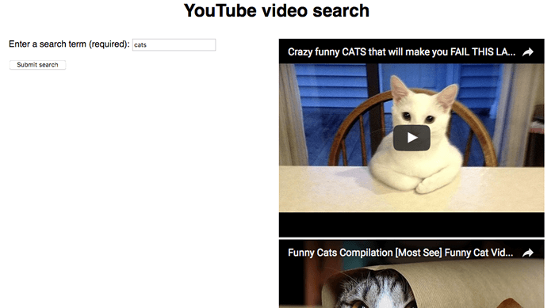

{{LearnSidebar}}{{PreviousMenuNext("Learn/JavaScript/Client-side_web_APIs/Fetching_data", "Learn/JavaScript/Client-side_web_APIs/Drawing_graphics", "Learn/JavaScript/Client-side_web_APIs")}}

지금까지 살펴본 API는 브라우저에 내장되어 있지만 모든 API가 내장되어 있는 것은 아닙니다. Google 지도, 트위터, 페이스북, 페이팔 등 많은 대형 웹사이트와 서비스는 개발자가 데이터(예: 블로그에 트위터 스트림 표시) 또는 서비스(예: 페이스북 로그인을 사용하여 사용자 로그인)를 사용할 수 있도록 API를 제공합니다. 이 도움말에서는 브라우저 API와 타사 API의 차이점을 살펴보고 후자의 일반적인 사용 사례를 소개합니다.

<table>
  <tbody>
    <tr>
      <th scope="row">전제 조건:</th>
      <td>
        자바스크립트 기초(
        <a href="/ko/docs/Learn/JavaScript/First_steps">첫 번째 단계</a>,
        <a href="/ko/docs/Learn/JavaScript/Building_blocks"
          >빌딩 블록</a
        >,
        <a href="/ko/docs/Learn/JavaScript/Objects">자바스크립트 객체 참조</a>), 
        <a href="/ko/docs/Learn/JavaScript/Client-side_web_APIs/Introduction"
          >클라이언트 측 API의 기본 사항</a
        >
      </td>
    </tr>
    <tr>
      <th scope="row">목표:</th>
      <td>
        타사 API의 작동 방식과 이를 사용하여 웹사이트를 개선하는 방법을 배웁니다.
      </td>
    </tr>
  </tbody>
</table>

## 타사 API란 무엇인가요?

타사 API는 타사(일반적으로 Facebook, Twitter 또는 Google과 같은 회사)에서 제공하는 API로, JavaScript를 통해 해당 기능에 액세스하여 사이트에서 사용할 수 있도록 합니다. 가장 대표적인 예 중 하나는 매핑 API를 사용하여 페이지에 사용자 정의 지도를 표시하는 것입니다.

[간단한 Mapquest API 예제](https://github.com/mdn/learning-area/tree/main/javascript/apis/third-party-apis/mapquest) 를 살펴보고 이를 통해 타사 API가 브라우저 API와 어떻게 다른지 설명해 보겠습니다.

> **참고:** [모든 코드 예제를 한 번에 받고](/ko/docs/Learn#getting_our_code_examples) 싶을 수도 있는데, 이 경우 리포지토리에서 각 섹션에 필요한 예제 파일을 검색하면 됩니다.

### 타사 서버에서 찾을 수 있습니다.

브라우저 API는 브라우저에 내장되어 있으므로 JavaScript에서 바로 액세스할 수 있습니다. 예를 들어, [소개 글에서 살펴본](/ko/docs/Learn/JavaScript/Client-side_web_APIs/Introduction#how_do_apis_work) 웹 오디오 API는 네이티브 {{domxref("AudioContext")}} 컨텍스트 객체를 사용하여 액세스합니다. 예를 들어

```js
const audioCtx = new AudioContext();
// …
const audioElement = document.querySelector('audio');
// …
const audioSource = audioCtx.createMediaElementSource(audioElement);
// etc.
```

반면 타사 API는 타사 서버에 위치합니다. 자바스크립트에서 액세스하려면 먼저 API 기능에 연결하여 페이지에서 사용할 수 있도록 설정해야 합니다. 여기에는 일반적으로 맵퀘스트 예시에서 볼 수 있듯이 {{htmlelement("script")}} 요소를 통해 서버에서 사용할 수 있는 JavaScript 라이브러리에 먼저 연결해야 합니다:

```html
<script
  src="https://api.mqcdn.com/sdk/mapquest-js/v1.3.2/mapquest.js"
  defer></script>
<link
  rel="stylesheet"
  href="https://api.mqcdn.com/sdk/mapquest-js/v1.3.2/mapquest.css" />
```

그런 다음 해당 라이브러리에서 사용 가능한 개체를 사용할 수 있습니다. 예를 들어

```js
const map = L.mapquest.map('map', {
  center: [53.480759, -2.242631],
  layers: L.mapquest.tileLayer('map'),
  zoom: 12
});
```

여기서는 지도 정보를 저장할 변수를 만든 다음, 지도를 표시할 {{htmlelement("div")}} 요소의 ID('map')와 표시하려는 특정 지도의 세부 정보가 포함된 옵션 객체를 매개변수로 받는 `mapquest.map()` 메서드를 사용하여 새 지도를 만듭니다. 이 경우 지도의 중심 좌표, 표시할 지도 유형의 지도 레이어(`mapquest.tileLayer()` 메서드를 사용하여 생성), 기본 확대/축소 수준을 지정합니다.

이것이 Mapquest API가 간단한 지도를 그리는 데 필요한 모든 정보입니다. 연결하려는 서버는 표시하려는 영역에 적합한 지도 타일을 표시하는 등의 복잡한 작업을 모두 처리합니다.

> **참고:** 일부 API는 기능에 대한 액세스를 약간 다르게 처리하므로 개발자가 데이터를 검색하기 위해 특정 URL 패턴으로 HTTP 요청을 해야 합니다. 이를 [RESTful API라고 하며, 나중에 예시를 보여드리겠습니다](#a_restful_api_%e2%80%94_nytimes).

### 일반적으로 API 키가 필요합니다.

브라우저 API의 보안은 [첫 번째 글에서 설명](/ko/docs/Learn/JavaScript/Client-side_web_APIs/Introduction#they_have_additional_security_mechanisms_where_appropriate) 한 것처럼 권한 프롬프트에 의해 처리되는 경향이 있습니다. 이는 사용자가 방문하는 웹사이트에서 어떤 일이 일어나고 있는지 알 수 있도록 하여 악의적인 방식으로 API를 사용하는 사람의 피해를 줄이기 위한 것입니다.

타사 API는 권한 시스템이 약간 다른데, 개발자가 API 기능에 액세스할 수 있도록 개발자 키를 사용하는 경향이 있으며, 이는 사용자보다는 API 공급업체를 보호하기 위한 것입니다.

Mapquest API 예제에서 다음과 유사한 줄을 찾을 수 있습니다:

```js
L.mapquest.key = 'YOUR-API-KEY-HERE';
```

이 줄은 애플리케이션에서 사용할 API 또는 개발자 키를 지정합니다. 애플리케이션 개발자가 키를 신청하여 받은 다음 코드에 포함시켜야 API의 기능에 대한 액세스가 허용됩니다. 이 예에서는 방금 플레이스홀더를 제공했습니다.

> **참고:** 자신만의 예시를 만들 때는 플레이스홀더 대신 고유한 API 키를 사용할 수 있습니다.

다른 API는 약간 다른 방식으로 키를 포함해야 할 수도 있지만 대부분의 경우 패턴은 비교적 유사합니다.

키를 요구하면 API 제공업체가 API 사용자의 행동에 대해 책임을 물을 수 있습니다. 개발자가 키를 등록하면 API 제공업체에 알려지게 되고, 개발자가 API를 악의적으로 사용하기 시작하면(예: 사용자의 위치를 추적하거나 API 작동을 중지하기 위해 대량의 요청을 스팸으로 보내는 등) 조치를 취할 수 있습니다. 가장 쉬운 조치는 API 권한을 취소하는 것입니다.

## Mapquest 예제 확장하기

Mapquest 예제에 몇 가지 기능을 추가하여 API의 다른 기능을 사용하는 방법을 보여드리겠습니다.

1. 이 섹션을 시작하려면 새 디렉터리에 [mapquest 시작 파일](https://github.com/mdn/learning-area/blob/main/javascript/apis/third-party-apis/mapquest/start/index.html) 의 복사본을 만듭니다. [예제 리포지토리를 이미 복제](/ko/docs/Learn#getting_our_code_examples) 했다면 이 파일의 사본이 이미 있을 것이며, 이 파일은 _javascript/apis/third-party-apis/mapquest/start_ 디렉터리에서 찾을 수 있습니다.
2. 다음으로 [Mapquest 개발자 사이트](https://developer.mapquest.com/) 로 이동하여 계정을 생성한 다음 예제에 사용할 개발자 키를 생성해야 합니다. (작성 당시 사이트에서는 이를 "consumer key"라고 불렀으며, 키 생성 과정에서 선택 사항인 "콜백 URL"도 요청했습니다. 여기에 URL을 입력할 필요는 없으며 그냥 비워 두세요.)
3. 시작 파일을 열고 API 키 자리 표시자를 사용자 키로 바꿉니다.

### 지도 유형 변경하기

Mapquest API로 표시할 수 있는 지도 유형에는 여러 가지가 있습니다. 이렇게 하려면 다음 줄을 찾습니다:

```js
layers: L.mapquest.tileLayer('map')
```

하이브리드 스타일 맵을 표시하려면 `'map'`을 `'hybrid'`로 변경해 보세요. 다른 값도 사용해 보세요. [타일레이어 참조 페이지](https://developer.mapquest.com/documentation/mapquest-js/v1.3/l-mapquest-tile-layer/) 에는 사용 가능한 다양한 옵션과 더 많은 정보가 나와 있습니다.

### 다양한 컨트롤 추가하기

지도에는 다양한 컨트롤을 사용할 수 있지만 기본적으로 줌 컨트롤만 표시됩니다. `map.addControl()` 메서드를 사용하여 사용 가능한 컨트롤을 확장할 수 있으며, 이를 코드에 추가하세요:

```js
map.addControl(L.mapquest.control());
```

[mapquest.control() 메서드](https://developer.mapquest.com/documentation/mapquest-js/v1.3/l-mapquest-control/) 는 모든 기능을 갖춘 간단한 컨트롤 세트를 생성하며, 기본적으로 오른쪽 상단에 배치됩니다. 컨트롤의 위치를 지정하는 문자열인 `position` 속성을 포함하는 옵션 개체를 컨트롤의 매개변수로 지정하여 위치를 조정할 수 있습니다. 예를 들어 이렇게 해 보세요:

```js
  map.addControl(L.mapquest.control({ position: 'bottomright' }));
```

다른 유형의 컨트롤(예: [`mapquest.searchControl()`](https://developer.mapquest.com/documentation/mapquest-js/v1.3/l-mapquest-search-control/), [`mapquest.satelliteControl()`](https://developer.mapquest.com/documentation/mapquest-js/v1.3/l-mapquest-satellite-control/))도 사용할 수 있으며, 일부는 매우 복잡하고 강력합니다. 직접 사용해보고 어떤 것이 가능한지 확인해 보세요.

### 사용자 정의 마커 추가하기

지도의 특정 지점에 마커(아이콘)를 추가하는 방법은 간단합니다. [`L.marker()`](https://leafletjs.com/reference.html#marker) 메서드(관련 Leaflet.js 문서에 설명되어 있음)를 사용하기만 하면 됩니다. 예제에 `window.onload` 안에 다음 코드를 다시 추가합니다:

```js
L.marker([53.480759, -2.242631], {
  icon: L.mapquest.icons.marker({
    primaryColor: '#22407F',
    secondaryColor: '#3B5998',
    shadow: true,
    size: 'md',
    symbol: 'A'
  })
})
.bindPopup('This is Manchester!')
.addTo(map);
```

보시다시피, 가장 간단하게는 마커를 표시할 좌표가 포함된 배열과 해당 지점에 표시할 아이콘을 정의하는 `icon` 속성이 포함된 옵션 객체라는 두 개의 매개변수가 필요합니다.

아이콘은 보시다시피 마커의 색상 및 크기와 같은 정보를 포함하는 [`mapquest.icons.marker()`](https://developer.mapquest.com/documentation/mapquest-js/v1.3/l-mapquest-icons/) 메서드를 사용하여 정의됩니다.

첫 번째 메서드 호출의 끝에 마커를 클릭할 때 표시할 콘텐츠를 정의하는 `.bindPopup('This is Manchester!')`을 연결합니다.

마지막으로 `.addTo(map)`를 체인의 끝에 연결하여 실제로 마커를 맵에 추가합니다.

문서에 나와 있는 다른 옵션들을 사용해보고 어떤 기능이 있는지 확인해 보세요! 맵퀘스트는 길 찾기, 검색 등과 같은 꽤 고급 기능을 제공합니다.

> **참고:** 예제가 작동하는 데 문제가 있는 경우, [완성된 버전](https://github.com/mdn/learning-area/blob/main/javascript/apis/third-party-apis/mapquest/finished/script.js) 과 코드를 비교해 보세요.

## A RESTful API — NYTimes

이제 또 다른 API 예제인 [New York Times API](https://developer.nytimes.com) 를 살펴보겠습니다. 이 API를 사용하면 뉴욕 타임즈 뉴스 기사 정보를 검색하여 사이트에 표시할 수 있습니다. 이러한 유형의 API를 **RESTful API** 라고 하는데, Mapquest에서 했던 것처럼 JavaScript 라이브러리의 기능을 사용하여 데이터를 가져오는 대신 검색어 및 기타 속성과 같은 데이터를 URL에 인코딩하여(종종 URL 매개변수로) 특정 URL에 HTTP 요청을 수행하여 데이터를 가져옵니다. 이는 API에서 흔히 접할 수 있는 패턴입니다.

## 타사 API를 사용하기 위한 접근 방식

아래에서는 NYTimes API를 사용하는 방법을 보여 드리는 연습을 통해 새로운 API로 작업할 때 접근 방식으로 사용할 수 있는 보다 일반적인 단계를 제공합니다.

### 문서 찾기

타사 API를 사용하려면 해당 API에 어떤 기능이 있는지, 어떻게 사용하는지 등을 알 수 있도록 문서가 어디에 있는지 찾는 것이 필수적입니다. 뉴욕타임즈 API 문서는 <https://developer.nytimes.com/> 에 있습니다.

### 개발자 키 받기

대부분의 API는 보안 및 책임의 이유로 일종의 개발자 키를 사용해야 합니다. <https://developer.nytimes.com/get-started> 에서 안내에 따라 NYTimes API 키를 신청하세요.

1. 기사 검색 API에 대한 키를 요청해 보겠습니다. 새 앱을 만들고 이 앱을 사용하려는 API로 선택합니다(이름과 설명을 입력하고 "Article Search API" 아래의 스위치를 켜짐 위치로 전환한 다음 "Create"를 클릭합니다).
2. 결과 페이지에서 API 키를 받습니다.
3. 이제 예제를 시작하기 위해 [nytimes/start](https://github.com/mdn/learning-area/tree/main/javascript/apis/third-party-apis/nytimes/start) 디렉터리에 있는 모든 파일의 복사본을 만듭니다. [예제 리포지토리를 이미 복제](/ko/docs/Learn#getting_our_code_examples) 했다면 이러한 파일의 복사본이 이미 있을 것이며, 이 복사본은 _javascript/apis/third-party-apis/nytimes/start_ 디렉터리에서 찾을 수 있습니다. 처음에 `script.js` 파일에는 예제 설정에 필요한 여러 변수가 포함되어 있으며, 아래에서 필요한 기능을 채워 넣을 것입니다.

앱에서 검색어와 시작 및 종료 날짜(선택 사항)를 입력하면 이를 사용하여 기사 검색 API를 쿼리하고 검색 결과를 표시할 수 있습니다.


### API를 앱에 연결하기

먼저 API와 앱을 연결해야 합니다. 이 API의 경우 올바른 URL로 서비스에서 데이터를 요청할 때마다 API 키를 [get](/ko/docs/Web/HTTP/Methods/GET) 매개변수에 포함시켜야 합니다.

1. 다음 줄을 찾습니다:

   ```js
   const key = 'INSERT-YOUR-API-KEY-HERE';
   ```

   기존 API 키를 이전 섹션에서 얻은 실제 API 키로 바꿉니다.

2. "`// Event listeners to control the functionality`" 주석 아래에 다음 줄을 JavaScript에 추가합니다. 그러면 양식이 제출될 때(버튼이 눌려질 때) `submitSearch()`라는 함수가 실행됩니다.

   ```js
   searchForm.addEventListener('submit', submitSearch);
   ```

3. 이제 이전 줄 아래에 `submitSearch()` 및 `fetchResults()` 함수 정의를 추가합니다:

   ```js
   function submitSearch(e) {
     pageNumber = 0;
     fetchResults(e);
   }

   function fetchResults(e) {
     // Use preventDefault() to stop the form submitting
     e.preventDefault();

     // Assemble the full URL
     let url = `${baseURL}?api-key=${key}&page=${pageNumber}&q=${searchTerm.value}&fq=document_type:("article")`;

     if (startDate.value !== '') {
       url = `${url}&begin_date=${startDate.value}`;
     };

     if (endDate.value !== '') {
       url = `${url}&end_date=${endDate.value}`;
     };
   }
   ```

`submitSearch()`는 페이지 번호를 0으로 다시 설정하여 시작한 다음 `fetchResults()`를 호출합니다. 이 함수는 먼저 이벤트 객체에서 [`preventDefault()`](/ko/docs/Web/API/Event/preventDefault) 를 호출하여 실제로 양식이 제출되는 것을 중지합니다(예제가 깨질 수 있음). 다음으로, 몇 가지 문자열 조작을 사용하여 요청할 전체 URL을 조립합니다. 이 데모에서 필수라고 생각되는 부분부터 조립해 보겠습니다:

- 기본 URL(`baseURL` 변수에서 가져옴).
- `api-key` URL 매개변수에 지정해야 하는 API 키(`key` 변수에서 값을 가져옴).
- 페이지 번호: `page` URL 매개변수에 지정해야 하는 페이지 번호(`pageNumber` 변수에서 값을 가져옴).
- 검색 용어는 `q` URL 매개변수에 지정해야 합니다(`searchTerm` 텍스트 {{htmlelement("input")}} 값에서 값을 가져옴).
- `fq` URL 매개 변수를 통해 전달된 표현식에 지정된 대로 결과를 반환할 문서 유형입니다. 이 경우 문서를 반환하려고 합니다.

다음으로, 몇 개의 [`if ()`](/ko/docs/Web/JavaScript/Reference/Statements/if...else) 문을 사용하여 `startDate` 및 `endDate` 요소에 값이 채워져 있는지 확인합니다. 값이 채워져 있으면 해당 값을 `begin_date` 및 `end_date` URL 매개 변수에 각각 지정된 URL에 추가합니다.

따라서 완전한 URL은 다음과 같이 표시됩니다:

```
https://api.nytimes.com/svc/search/v2/articlesearch.json?api-key=YOUR-API-KEY-HERE&page=0&q=cats&fq=document_type:("article")&begin_date=20170301&end_date=20170312
```

> **참고:** 포함할 수 있는 URL 매개변수에 대한 자세한 내용은 [NYTimes 개발자 문서](https://developer.nytimes.com/) 에서 확인할 수 있습니다.

> **참고:** 이 예시에는 기본적인 양식 데이터 유효성 검사가 포함되어 있습니다. 검색어 필드는 양식을 제출하기 전에 입력해야 하며(`required` 속성을 사용하여 달성), 날짜 필드에는 `pattern` 속성이 지정되어 있으므로 값이 8개의 숫자로 구성되지 않으면 제출되지 않습니다(`pattern="[0-9]{8}"`). 이러한 작동 방식에 대한 자세한 내용은 [양식 데이터 유효성 검사](/ko/docs/Learn/Forms/Form_validation) 를 참조하세요.

### API에서 데이터 요청하기

이제 URL을 만들었으니 요청을 해보겠습니다. [Fetch API](/ko/docs/Web/API/Fetch_API/Using_Fetch) 를 사용하여 요청하겠습니다.

닫는 중괄호 바로 위에 있는 `fetchResults()` 함수 안에 다음 코드 블록을 추가합니다:

```js
// Use fetch() to make the request to the API
fetch(url)
  .then((response) => response.json())
  .then((json) => displayResults(json))
  .catch((error) => console.error(`Error fetching data: ${error.message}`));
```

여기서는 `url` 변수를 [`fetch()`](/ko/docs/Web/API/fetch) 에 전달하여 요청을 실행하고, [`json()`](/ko/docs/Web/API/Response/json) 함수를 사용하여 응답 본문을 JSON으로 변환한 다음, 결과 JSON을 `displayResults()` 함수에 전달하여 UI에 데이터를 표시할 수 있도록 합니다. 또한 발생할 수 있는 모든 오류를 포착하고 기록합니다.

### 데이터 표시하기

이제 데이터를 표시하는 방법을 살펴봅시다. `fetchResults()` 함수 아래에 다음 함수를 추가합니다.

```js
function displayResults(json) {
  while (section.firstChild) {
    section.removeChild(section.firstChild);
  }

  const articles = json.response.docs;

  nav.style.display = articles.length === 10 ? 'block' : 'none';

  if (articles.length === 0) {
    const para = document.createElement('p');
    para.textContent = 'No results returned.'
    section.appendChild(para);
  } else {
    for (const current of articles) {
      const article = document.createElement('article');
      const heading = document.createElement('h2');
      const link = document.createElement('a');
      const img = document.createElement('img');
      const para1 = document.createElement('p');
      const keywordPara = document.createElement('p');
      keywordPara.classList.add('keywords');

      console.log(current);

      link.href = current.web_url;
      link.textContent = current.headline.main;
      para1.textContent = current.snippet;
      keywordPara.textContent = 'Keywords: ';
      for (const keyword of current.keywords) {
        const span = document.createElement('span');
        span.textContent = `${keyword.value} `;
        keywordPara.appendChild(span);
      }

      if (current.multimedia.length > 0) {
        img.src = `http://www.nytimes.com/${current.multimedia[0].url}`;
        img.alt = current.headline.main;
      }

      article.appendChild(heading);
      heading.appendChild(link);
      article.appendChild(img);
      article.appendChild(para1);
      article.appendChild(keywordPara);
      section.appendChild(article);
    }
  }
};
```

여기에는 많은 코드가 있으므로 단계별로 설명하겠습니다:

- [`while`](/ko/docs/Web/JavaScript/Reference/Statements/while) 루프는 DOM 요소의 모든 내용(이 경우 {{htmlelement("section")}} 요소)을 삭제하는 데 사용되는 일반적인 패턴입니다. `<section>`에 첫 번째 자식이 있는지 계속 확인하고, 자식이 있으면 첫 번째 자식을 제거합니다. `<section>`에 더 이상 자식이 없으면 루프가 종료됩니다.
- 다음으로, 검색에서 반환된 문서를 나타내는 모든 객체가 들어 있는 배열인 `json.response.docs`와 동일한 `articles` 변수를 설정합니다. 이는 순전히 다음 코드를 좀 더 간단하게 만들기 위한 것입니다.
- 첫 번째 [`if ()`](/ko/docs/Web/JavaScript/Reference/Statements/if...else) 블록은 10개 문서가 반환되는지 확인합니다(API는 한 번에 최대 10개 문서까지 반환합니다.) 10개 문서가 반환되면 이전 10개/다음 10개 페이지 매김 버튼이 포함된 {{htmlelement("nav")}} 가 표시됩니다. 10개 미만의 문서가 반환되면 모두 한 페이지에 들어가므로 페이지 매김 버튼을 표시할 필요가 없습니다. 다음 섹션에서 페이지 매김 기능을 연결하겠습니다.
- 다음 `if()` 블록은 반환된 문서가 없는지 확인합니다. 그렇다면 아무 것도 표시하지 않고 "No results returned."라는 텍스트가 포함된 {{htmlelement("p")}} 을 생성하여 `<section>`에 삽입합니다.
- 일부 기사가 반환되면 먼저 각 뉴스 기사를 표시하는 데 사용할 모든 요소를 만들고 각 요소에 적절한 콘텐츠를 삽입한 다음 적절한 위치의 DOM에 삽입합니다. 기사 객체에서 어떤 속성에 표시하기에 적합한 데이터가 포함되어 있는지 파악하기 위해 기사 검색 API 참조를 참조했습니다([NYTimes APIs](https://developer.nytimes.com/apis) 참조). 이러한 작업의 대부분은 매우 당연한 것이지만 몇 가지를 언급할 가치가 있습니다:

  - [`for...of`](/ko/docs/Web/JavaScript/Reference/Statements/for...of) 루프를 사용하여 각 기사와 연관된 모든 키워드를 살펴보고 각 키워드를 자체 {{htmlelement("span")}} 안에 `<p>` 안에 삽입했습니다. 이렇게 하면 각각의 스타일을 쉽게 지정할 수 있습니다.
  - 일부 스토리에는 이미지가 없는 경우도 있으므로 `if ()` 블록(`if (current.multimedia.length > 0) { }`)을 사용하여 각 기사에 연결된 이미지가 있는지 확인했습니다. 이미지가 있는 경우에만 첫 번째 이미지를 표시하고, 그렇지 않으면 오류가 발생합니다.

### 페이지 매김 버튼 연결하기

페이지 매김 버튼이 작동하도록 하기 위해 `pageNumber` 변수의 값을 증가(또는 감소)시킨 다음 페이지 URL 매개변수에 포함된 새 값으로 가져오기 요청을 다시 실행합니다. 이는 NYTimes API가 한 번에 10개의 결과만 반환하기 때문에 작동하며, 10개 이상의 결과를 사용할 수 있는 경우 `page` URL 매개 변수가 0으로 설정된 경우 첫 번째 10개(0~9)(또는 전혀 포함되지 않은 경우 0이 기본값임), 1로 설정된 경우 다음 10개(10~19)를 반환하는 식으로 작동합니다.

이를 통해 간단한 페이지 매김 함수를 작성할 수 있습니다.

1. 기존 [`addEventListener()`](/ko/docs/Web/API/EventTarget/addEventListener) 호출 아래에 이 두 개의 새 함수를 추가하면 관련 버튼이 클릭될 때 `nextPage()` 및 `previousPage()` 함수가 호출됩니다:

   ```js
   nextBtn.addEventListener('click', nextPage);
   previousBtn.addEventListener('click', previousPage);
   ```

2. 이전에 추가한 함수 아래에 두 함수를 정의해 보겠습니다. 지금 이 코드를 추가하세요:

   ```js
   function nextPage(e) {
     pageNumber++;
     fetchResults(e);
   };

   function previousPage(e) {
     if (pageNumber > 0) {
       pageNumber--;
     } else {
       return;
     }
     fetchResults(e);
   };
   ```

   첫 번째 함수는 `pageNumber` 변수를 증가시킨 다음 `fetchResults()` 함수를 다시 실행하여 다음 페이지의 결과를 표시합니다.

   두 번째 함수는 거의 동일한 방식으로 역순으로 작동하지만, `pageNumber`를 감소시키기 전에 `pageNumber`가 이미 0이 아닌지 확인하는 추가 단계를 수행해야 합니다. 마이너스 `page` URL 매개변수를 사용하여 가져오기 요청이 실행되면 오류가 발생할 수 있기 때문입니다. `pageNumber`가 이미 0이면 함수에서 [`return`](/ko/docs/Web/JavaScript/Reference/Statements/return) 되며, 이미 첫 번째 페이지에 있는 경우 동일한 결과를 다시 로드할 필요가 없습니다.

> **참고:** [완성된 NYTimes API 예제 코드는 GitHub에서](https://github.com/mdn/learning-area/blob/main/javascript/apis/third-party-apis/nytimes/finished/index.html) 찾을 수 있습니다([여기에서 실시간으로 실행되는 모습도 확인할 수 있습니다](https://mdn.github.io/learning-area/javascript/apis/third-party-apis/nytimes/finished/)).

## YouTube 예제

공부하고 배울 수 있는 또 다른 예제도 만들었습니다. [YouTube 동영상 검색 예제](https://mdn.github.io/learning-area/javascript/apis/third-party-apis/youtube/) 를 참조하세요. 여기에는 두 개의 관련 API가 사용됩니다:

- YouTube 동영상을 검색하고 결과를 반환하는 [YouTube 데이터 API](https://developers.google.com/youtube/v3/docs/).
- 반환된 동영상 예시를 IFrame 동영상 플레이어에 표시하여 시청할 수 있도록 하는 [YouTube IFrame 플레이어 API](https://developers.google.com/youtube/iframe_api_reference).

이 예제는 앱을 빌드하는 데 두 개의 관련 타사 API가 함께 사용되는 것을 보여주기 때문에 흥미롭습니다. 첫 번째는 RESTful API이고, 두 번째는 맵퀘스트와 비슷하게 작동합니다(API별 메서드 등 포함). 하지만 두 API 모두 페이지에 적용하려면 자바스크립트 라이브러리가 필요하다는 점에 유의할 필요가 있습니다. RESTful API에는 HTTP 요청을 처리하고 결과를 반환하는 데 사용할 수 있는 함수가 있습니다.



이 글에서는 이 예제에 대해 더 이상 설명하지 않겠습니다. [소스 코드](https://github.com/mdn/learning-area/tree/main/javascript/apis/third-party-apis/youtube) 에는 작동 방식을 설명하는 자세한 주석이 삽입되어 있습니다.

이 예제를 실행하려면 다음을 수행해야 합니다:

- [YouTube 데이터 API 개요](https://developers.google.com/youtube/v3/getting-started) 문서를 읽습니다.
- [활성화된 API 페이지](https://console.cloud.google.com/apis/enabled) 로 이동하여 API 목록에서 YouTube 데이터 API v3의 상태가 켜짐으로 설정되어 있는지 확인합니다.
- [Google 클라우드](https://cloud.google.com/) 에서 API 키를 받습니다.
- 소스 코드에서 `ENTER-API-KEY-HERE` 문자열을 찾아 API 키로 바꿉니다.
- 웹 서버를 통해 예제를 실행합니다. 브라우저에서 직접 실행하면 작동하지 않습니다(예: `file://` URL을 통해).

## 요약

이 글에서는 타사 API를 사용하여 웹사이트에 기능을 추가하는 유용한 방법을 소개했습니다.

{{PreviousMenuNext("Learn/JavaScript/Client-side_web_APIs/Fetching_data", "Learn/JavaScript/Client-side_web_APIs/Drawing_graphics", "Learn/JavaScript/Client-side_web_APIs")}}
