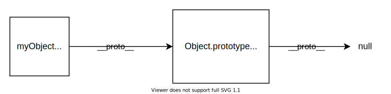

{{LearnSidebar}}{{PreviousMenuNext("Learn/JavaScript/Objects/Basics", "Learn/JavaScript/Objects/Object-oriented_programming", "Learn/JavaScript/Objects")}}

프로토타입은 자바스크립트 객체가 서로의 기능을 상속하는 메커니즘입니다. 이 문서에서는 프로토타입이 무엇인지, 프로토타입 체인이 어떻게 작동하는지, 객체의 프로토타입을 어떻게 설정할 수 있는지 설명합니다.

<table>
  <tbody>
    <tr>
      <th scope="row">사전 요구 사항:</th>
      <td>
        JavaScript 함수에 대한 이해, JavaScript 기본 사항
        (<a href="/ko/docs/Learn/JavaScript/First_steps">첫 단계</a> 및
        <a href="/ko/docs/Learn/JavaScript/Building_blocks"
          >빌딩 블록</a
        > 참조), OOJS 기본 사항(<a href="/ko/docs/Learn/JavaScript/Objects/Basics"
          >객체 소개</a
        >참조)에 익숙해야 합니다.
      </td>
    </tr>
    <tr>
      <th scope="row">목표:</th>
      <td>
        자바스크립트 객체 프로토타입, 프로토타입 체인의 작동 방식, 객체의 프로토타입을 설정하는 방법을 이해합니다.
      </td>
    </tr>
  </tbody>
</table>

## 프로토타입 체인

브라우저의 콘솔에서 객체 리터럴을 생성해 보세요:

```js
const myObject = {
  city: "Madrid",
  greet() {
    console.log(`Greetings from ${this.city}`);
  },
};

myObject.greet(); // Greetings from Madrid
```

이 객체는 `city`라는 데이터 프로퍼티와 `greet()` 메서드가 하나씩 있는 객체입니다. 콘솔에 `myObject.` 와 같이 객체 이름 뒤에 마침표를 입력하면 이 객체에 사용할 수 있는 모든 속성 목록이 콘솔에 표시됩니다. `city`와 `greet`뿐만 아니라 다른 많은 프로퍼티가 있음을 알 수 있습니다!

```
__defineGetter__
__defineSetter__
__lookupGetter__
__lookupSetter__
__proto__
city
constructor
greet
hasOwnProperty
isPrototypeOf
propertyIsEnumerable
toLocaleString
toString
valueOf
```

그 중 하나에 액세스해 보세요:

```js
myObject.toString(); // "[object Object]"
```

작동합니다(`toString()`이 무엇을 하는지 명확하지 않더라도).

이 추가 프로퍼티는 무엇이며, 그 출처는 어디일까요?

자바스크립트의 모든 객체에는 **프로토타입** 이라고 하는 내장 프로퍼티가 있습니다. 프로토타입은 그 자체로 객체이므로 프로토타입은 자체 프로토타입을 가지며, 이를 **프로토타입 체인** 이라고 합니다. 프로토타입 체인은 자체 프로토타입에 대해 `null`을 갖는 프로토타입에 도달하면 끝납니다.

> **참고:** 프로토타입을 가리키는 객체의 속성은 `prototype`이라고 부르지 **않습니다**. 그 이름은 표준이 아니지만 실제로 모든 브라우저는 [`__proto__`](/ko/docs/Web/JavaScript/Reference/Global_Objects/Object/proto)를 사용합니다. 객체의 프로토타입에 액세스하는 표준 방법은 {{jsxref("Object/getPrototypeOf", "Object.getPrototypeOf()")}} 메서드입니다.

객체의 프로퍼티에 접근하려고 할 때: 객체 자체에서 프로퍼티를 찾을 수 없는 경우, 프로토타입에서 프로퍼티를 검색합니다. 그래도 프로퍼티를 찾을 수 없으면 프로퍼티를 찾거나 체인의 끝에 도달할 때까지 프로토타입의 프로토타입을 검색하는 식으로 프로퍼티를 검색하며, 이 경우 `undefined` 가 반환됩니다.

따라서 myObject.toString()을 호출하면 브라우저는:

- `myObject`에서 `toString`을 찾습니다.
- 찾을 수 없으므로 `myObject` 의 프로토타입 객체에서 `toString`을 찾습니다.
- 찾아서 호출합니다.

`myObject`의 프로토타입은 무엇인가요? 이를 알아내기 위해 `Object.getPrototypeOf()` 함수를 사용할 수 있습니다:

```js
Object.getPrototypeOf(myObject); // Object { }
```

이것은 `Object.prototype`,이라는 객체이며, 모든 객체가 기본적으로 가지고 있는 가장 기본적인 프로토타입입니다. `Object.prototype` 의 프로토타입은 `null`이므로 프로토타입 체인의 끝에 있습니다:



객체의 프로토타입이 항상 `Object.prototype`인 것은 아닙니다. 이렇게 해보세요:

```js
const myDate = new Date();
let object = myDate;

do {
  object = Object.getPrototypeOf(object);
  console.log(object);
} while (object);

// Date.prototype
// Object { }
// null
```

이 코드는 `Date` 객체를 생성한 다음 프로토타입 체인을 따라 올라가면서 프로토타입을 기록합니다. 이 코드는 `myDate` 의 프로토타입이 `Date.prototype` 객체이고, 그 프로토타입이 `Object.prototype`임을 보여줍니다.


실제로 `myDate2.getMonth()`와 같이 익숙한 메서드를 호출할 때는 `Date.prototype`에 정의된 메서드를 호출하는 것입니다.

## 섀도잉 프로퍼티

오브젝트에서 프로퍼티를 정의할 때 같은 이름의 프로퍼티가 오브젝트의 프로토타입에 정의되어 있으면 어떻게 될까요? 살펴보겠습니다:

```js
const myDate = new Date(1995, 11, 17);

console.log(myDate.getYear()); // 95

myDate.getYear = function () {
  console.log("something else!");
};

myDate.getYear(); // 'something else!'
```

프로토타입 체인에 대한 설명을 고려하면 예측할 수 있을 것입니다. `getYear()` 를 호출하면 브라우저는 먼저 `myDate` 에서 해당 이름의 프로퍼티를 찾고, `myDate` e에 프로퍼티가 정의되어 있지 않은 경우에만 프로토타입을 확인합니다. 따라서 `getYear()` 를 `myDate`에 추가하면 `myDate` 에 있는 버전이 호출됩니다.

이를 프로퍼티 "섀도잉"이라고 합니다.

## 프로토타입 설정하기

자바스크립트에서 객체의 프로토타입을 설정하는 방법에는 여러 가지가 있는데, 여기서는 두 가지를 설명하겠습니다: `Object.create()` 와 생성자.

### Object.create 사용

`Object.create()` 메서드는 새 객체를 생성하고 새 객체의 프로토타입으로 사용할 객체를 지정할 수 있습니다.

다음은 예제입니다:

```js
const personPrototype = {
  greet() {
    console.log("hello!");
  },
};

const carl = Object.create(personPrototype);
carl.greet(); // hello!
```

여기서는 `greet()` 메서드가 있는 `personPrototype` 객체를 생성합니다. 그런 다음 `Object.create()` 를 사용하여 `personPrototype` 을 프로토타입으로 하는 새 객체를 만듭니다. 이제 새 객체에서 `greet()` 를 호출하면 프로토타입이 그 구현을 제공합니다.

### 생성자 사용하기

자바스크립트에서 모든 함수에는 `prototype`이라는 프로퍼티가 있습니다. 함수를 생성자로 호출하면 이 프로퍼티는 새로 생성된 객체의 프로토타입으로 설정됩니다(관례에 따라 `__proto__` 라는 프로퍼티에 있음).

따라서 생성자의 `prototype`을 설정하면 해당 생성자로 생성된 모든 객체에 해당 프로토타입이 지정되도록 할 수 있습니다:

```js
const personPrototype = {
  greet() {
    console.log(`hello, my name is ${this.name}!`);
  },
};

function Person(name) {
  this.name = name;
}

Object.assign(Person.prototype, personPrototype);
// or
// Person.prototype.greet = personPrototype.greet;
```

여기에서 생성합니다:

- `greet()` 메서드가 있는 객체 `personPrototype`
- 생성할 사람의 이름을 초기화하는 `Person()` 생성자 함수

그런 다음 [Object.assign](/ko/docs/Web/JavaScript/Reference/Global_Objects/Object/assign) 을 사용하여 `Person` 함수의 `prototype` 프로퍼티에 `personPrototype`에 정의된 메서드를 넣습니다.

이 코드가 끝나면 `Person()`을 사용하여 생성된 객체는 `Person.prototype`을 프로토타입으로 가져오고, 이 프로토타입에는 자동으로 `greet` 메서드가 포함됩니다.

```js
const reuben = new Person("Reuben");
reuben.greet(); // hello, my name is Reuben!
```

이는 앞서 `myDate`의 프로토타입이` Date.prototype`이라고 말한 이유도 설명해줍니다. 즉, `Dat`e 생성자의 `prototype` 속성이라는 것입니다.

### 자체 속성

위의 `Person` 생성자를 사용하여 생성한 객체에는 두 가지 프로퍼티가 있습니다:

- 생성자에서 설정되므로 `Person` 객체에 직접 나타나는 `name` 프로퍼티.
- 프로토타입에 설정된 `greet()` 메서드

메서드는 프로토타입에 정의되지만 데이터 프로퍼티는 생성자에 정의되는 이 패턴은 흔히 볼 수 있습니다. 그 이유는 메서드는 일반적으로 우리가 만드는 모든 객체에 대해 동일하지만, 각 객체가 데이터 속성에 대해 고유한 값을 갖기를 원하는 경우가 많기 때문입니다(여기서는 모든 사람의 이름이 다릅니다).

여기서 `name`과 같이 객체에 직접 정의된 프로퍼티를 **자체 프로퍼티** 라고 하며, 정적 {{jsxref("Object/hasOwn", "Object.hasOwn()")}} 메서드를 사용하여 프로퍼티가 자체 프로퍼티인지 여부를 확인할 수 있습니다:

```js
const irma = new Person("Irma");

console.log(Object.hasOwn(irma, "name")); // true
console.log(Object.hasOwn(irma, "greet")); // false
```

> **참고:** 여기에서는 정적이 아닌 {{jsxref("Object/hasOwnProperty", "Object.hasOwnProperty()")}} 메서드를 사용할 수도 있지만, 가능하면 `Object.hasOwn()`을 사용하는 것이 좋습니다.

## 프로토타입과 상속

프로토타입은 자바스크립트의 강력하고 매우 유연한 기능으로 코드를 재사용하고 객체를 결합할 수 있게 해줍니다.

특히 상속 기능을 지원합니다. **상속** 은 객체 지향 프로그래밍 언어의 기능으로, 프로그래머가 시스템의 일부 객체가 다른 객체의 보다 특수한 버전이라는 개념을 표현할 수 있게 해줍니다.

예를 들어 학교를 모델링하는 경우 교수와 학생이 있을 수 있는데, 둘 다 사람이므로 공통된 기능(예: 둘 다 이름이 있음)이 있지만 각각 추가 기능을 추가하거나(예: 교수에게는 가르치는 과목이 있음) 동일한 기능을 다른 방식으로 구현할 수 있습니다. OOP 시스템에서는 교수와 학생이 모두 사람 **으로부터 상속받는다** 고 말할 수 있습니다.

자바스크립트에서 `교수`와 `학생` 객체가 `Person` 프로토타입을 가질 수 있다면 공통 속성을 상속하면서 다른 속성을 추가하고 재정의할 수 있다는 것을 알 수 있습니다

다음 글에서는 객체 지향 프로그래밍 언어의 다른 주요 기능과 함께 상속을 살펴보고 자바스크립트가 이를 어떻게 지원하는지 살펴보겠습니다.

## 요약

이 문서에서는 프로토타입 객체 체인을 통해 객체가 서로의 기능을 상속하는 방법, 프로토타입 속성과 생성자에 메서드를 추가하는 데 사용하는 방법 및 기타 관련 주제를 포함하여 JavaScript 객체 프로토타입에 대해 설명했습니다.

다음 글에서는 객체 지향 프로그래밍의 기본 개념에 대해 살펴보겠습니다.

{{PreviousMenuNext("Learn/JavaScript/Objects/Basics", "Learn/JavaScript/Objects/Object-oriented_programming", "Learn/JavaScript/Objects")}}
