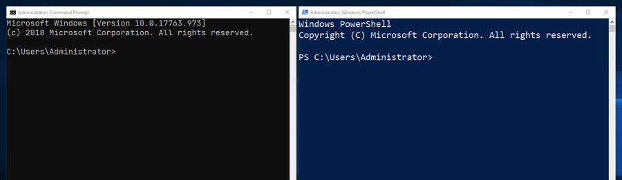

{{LearnSidebar}}{{PreviousMenuNext("Learn/Tools_and_testing/Understanding_client-side_tools/Overview","Learn/Tools_and_testing/Understanding_client-side_tools/Package_management", "Learn/Tools_and_testing/Understanding_client-side_tools")}}

개발 과정에서 터미널(또는 "명령줄")에서 몇 가지 명령을 실행해야 하는 경우가 있을 것입니다(사실상 같은 의미입니다). 이 글에서는 터미널에 대한 소개, 터미널에 입력해야 하는 필수 명령어, 명령어를 서로 연결하는 방법, 자체 명령줄 인터페이스(CLI) 도구를 추가하는 방법에 대해 설명합니다.

<table>
  <tbody>
    <tr>
      <th scope="row">사전 요구 사항:</th>
      <td>
        핵심 <a href="/ko/docs/Learn/HTML">HTML</a>,
        <a href="/ko/docs/Learn/CSS">CSS</a>, <a href="/ko/docs/Learn/JavaScript">JavaScript</a> 언어에 익숙해야 합니다.
      </td>
    </tr>
    <tr>
      <th scope="row">목표:</th>
      <td>
        터미널/커맨드 라인이 무엇인지, 어떤 기본 명령을 배워야 하는지, 새로운 커맨드 라인 도구를 설치하는 방법을 이해합니다.
      </td>
    </tr>
  </tbody>
</table>

## 터미널에 오신 것을 환영합니다

터미널은 텍스트 기반 프로그램을 실행하기 위한 텍스트 인터페이스입니다. 웹 개발을 위한 도구를 실행하는 경우 선택한 도구를 사용하기 위해 명령줄을 열고 몇 가지 명령을 실행해야 할 가능성이 거의 보장됩니다(이러한 도구를 **CLI 도구**, 즉 명령줄 인터페이스 도구라고 부르는 경우가 많습니다).

명령줄에 명령을 입력하면 수많은 도구를 사용할 수 있으며, 많은 도구가 시스템에 사전 설치되어 있고 패키지 레지스트리에서 설치할 수 있는 도구도 많습니다.
패키지 레지스트리는 앱 스토어와 비슷하지만, 대부분 명령줄 기반 도구와 소프트웨어를 위한 곳입니다.
이 장의 뒷부분에서 몇 가지 도구를 설치하는 방법을 살펴보고, 다음 장에서 패키지 레지스트리에 대해 자세히 알아보겠습니다.

명령줄에 대한 가장 큰 비판 중 하나는 사용자 경험이 크게 부족하다는 점입니다.
명령줄을 처음 보면 화면이 텅 비어 있고 커서가 깜빡이는 등 무엇을 해야 할지 명확하게 알려주는 도움말이 거의 없어 당황스러울 수 있습니다.

하지만 명령줄을 통해 할 수 있는 일은 매우 많으며, 약간의 안내와 연습을 통해 명령줄을 더 쉽게 사용할 수 있을 것입니다!
그렇기 때문에 이 챕터를 마련한 이유는 이 비우호적인 환경에서 시작하는 데 도움을 드리기 위해서입니다.

### 터미널은 어디에서 왔나요?

터미널은 1950~60년대부터 사용되기 시작했으며, 그 원래 형태는 오늘날 우리가 사용하는 것과 전혀 닮지 않았습니다(오히려 감사해야 할 일입니다). [컴퓨터 터미널](https://en.wikipedia.org/wiki/Computer_terminal) 에 대한 위키백과 항목에서 그 역사를 조금 읽어보실 수 있습니다.

그 이후로 터미널은 데스크톱 컴퓨터부터 클라우드에 숨어 있는 서버, 라즈베리 파이 제로와 같은 마이크로 컴퓨터, 심지어 휴대폰에 이르기까지 모든 운영 체제의 변함없는 기능으로 남아있습니다. 컴퓨터의 기본 파일 시스템과 저수준 기능에 직접 액세스할 수 있으므로, 사용법을 알고 있다면 복잡한 작업을 빠르게 수행하는 데 매우 유용합니다.

예를 들어 수백 개의 파일 제목을 "ch01-xxxx.png"에서 "ch02-xxxx.png"로 즉시 업데이트하는 명령을 작성하는 등 자동화에도 유용합니다. 파인더나 탐색기 GUI 앱을 사용하여 파일 이름을 업데이트하면 시간이 오래 걸립니다.

어쨌든, 터미널은 조만간 사라지지 않을 것입니다.

### 터미널은 어떻게 생겼나요?

아래에서 터미널로 이동할 수 있는 다양한 종류의 프로그램 중 몇 가지를 확인할 수 있습니다.

다음 이미지는 Windows에서 사용할 수 있는 명령 프롬프트를 보여 주는데, 시작 메뉴에서 프로그램 이름을 입력하여 실행할 수 있는 "cmd" 프로그램부터 "powershell"에 이르기까지 다양한 옵션이 있습니다.



그리고 아래에서는 macOS 터미널 애플리케이션을 볼 수 있습니다.


### 터미널에 어떻게 액세스하나요?

오늘날 많은 개발자가 유닉스 기반 도구(예: 터미널 및 터미널을 통해 액세스할 수 있는 도구)를 사용하고 있습니다. 현재 웹에 존재하는 많은 튜토리얼과 도구는 유감스럽게도 유닉스 기반 시스템을 지원하지만, 대부분의 시스템에서 사용할 수 있으니 걱정하지 마세요. 이 섹션에서는 선택한 시스템에서 터미널에 액세스하는 방법을 살펴봅니다.

#### Linux/유닉스

위에서 힌트를 제공했듯이 Linux/유닉스 시스템에는 기본적으로 애플리케이션에 나열된 터미널을 사용할 수 있습니다.

#### macOS

macOS에는 그래픽 사용자 인터페이스 아래에 있는 Darwin이라는 시스템이 있습니다. 다윈은 터미널과 저수준 도구에 대한 액세스를 제공하는 유닉스와 유사한 시스템입니다. macOS 다윈은 대부분 유닉스와 동등하며, 이 글을 진행하는 동안 걱정할 필요가 없을 만큼 충분히 훌륭합니다.

터미널은 macOS의 애플리케이션/유틸리티/터미널에서 사용할 수 있습니다.

#### 윈도우

다른 프로그래밍 도구와 마찬가지로, Windows에서 터미널(또는 명령줄)을 사용하는 것은 전통적으로 다른 운영 체제만큼 간단하거나 쉽지 않았습니다. 하지만 점점 나아지고 있습니다.

Windows에는 오랫동안 cmd('명령 프롬프트')라는 자체 터미널과 유사한 프로그램이 있었지만, 이는 유닉스 명령과 동등하지 않으며 구식 Windows DOS 프롬프트와 동일합니다.

Powershell([설치 프로그램을 찾으려면 여기를 참조](https://github.com/PowerShell/PowerShell)), Gitbash([Windows용 git](https://gitforwindows.org/) 도구 집합의 일부로 제공됨) 등 Windows에서 터미널 환경을 제공하기 위한 더 나은 프로그램이 존재합니다.

하지만 현재 Windows에 가장 적합한 옵션은 Windows 10 내부에서 직접 Linux 운영 체제를 실행하기 위한 호환성 계층인 WSL(Windows 하위 시스템 for Linux)로, 가상 머신 없이도 Windows에서 직접 '진정한 터미널'을 실행할 수 있습니다.

Windows 스토어에서 무료로 직접 설치할 수 있습니다. 필요한 모든 문서는 [Linux용 Windows 하위 시스템 설명서](https://docs.microsoft.com/windows/wsl/ 에서 찾을 수 있습니다.


Windows에서 어떤 옵션을 선택할지 고민 중이라면 WSL을 설치하는 것을 강력히 추천합니다. 기본 명령 프롬프트(`cmd`)를 그대로 사용할 수도 있고 많은 도구가 정상적으로 작동하지만, 유닉스 도구와 더 나은 동등성을 갖는다면 모든 것이 더 쉬워질 것입니다.

#### 참고: 명령줄과 터미널의 차이점은 무엇인가요?

일반적으로 이 두 용어는 같은 의미로 사용됩니다. 엄밀히 말하면 터미널은 셸을 시작하고 셸에 연결하는 소프트웨어입니다. 셸은 세션 및 세션 환경(프롬프트 및 바로 가기 등의 항목을 사용자 지정할 수 있는 곳)입니다. 명령줄은 명령을 입력하고 커서가 깜박이는 문자 그대로의 줄입니다.

### 터미널을 사용해야 하나요?

명령줄에서 사용할 수 있는 도구는 매우 다양하지만, [Visual Studio Code](https://code.visualstudio.com/) 와 같은 도구를 사용하는 경우 터미널을 직접 사용할 필요 없이 터미널 명령을 프록시로 사용할 수 있는 확장 프로그램도 많이 있습니다. 하지만 원하는 모든 작업을 수행할 수 있는 코드 편집기 확장 프로그램을 찾을 수는 없으며, 결국 터미널에 대한 경험을 쌓아야 합니다.

## 기본 내장 터미널 명령어

이제 터미널 명령어 몇 가지를 살펴보겠습니다! 기본적으로 명령줄로 할 수 있는 몇 가지 작업과 각 작업에 해당하는 도구의 이름을 소개합니다:

- 컴퓨터의 파일 시스템을 탐색하고 만들기, 복사, 이름 바꾸기, 삭제와 같은 기본 수준의 작업을 수행할 수 있습니다:

  - 디렉토리 구조 이동: `cd`
  - 디렉터리 생성: `mkdir`
  - 파일 만들기(및 메타데이터 수정): `touch`
  - 파일 복사: `cp`
  - 파일 이동: `mv`
  - 파일 또는 디렉터리 삭제: `rm`

- 특정 URL에 있는 파일 다운로드: `curl`
- 큰 텍스트 본문 내의 텍스트 조각 검색: `grep`
- 파일의 내용을 페이지별로 보기: `less`, `cat`
- 텍스트 스트림 조작 및 변환(예: HTML 파일에서 `<div>`의 모든 인스턴스를 `<article>`로 변경): `awk`, `tr`, `sed`

> **참고:** 웹에는 웹의 명령줄에 대해 훨씬 더 깊이 있게 다루는 좋은 튜토리얼이 많이 있습니다 - 이것은 간략한 소개일 뿐입니다!

이제 명령줄에서 이러한 도구 중 몇 가지를 사용하는 방법을 살펴봅시다. 더 진행하기 전에 터미널 프로그램을 열어보세요!

### 명령줄에서 탐색하기

명령줄을 방문하면 "무언가를 하기 위해" 특정 디렉토리로 이동해야 할 때가 있습니다. 모든 운영 체제(기본 설정이라고 가정)는 "홈" 디렉터리에서 터미널 프로그램을 시작하며, 여기에서 다른 위치로 이동하고 싶을 수 있습니다.

`cd` 명령으로 디렉터리를 변경할 수 있습니다. 엄밀히 말하면 cd는 프로그램이 아니라 빌트인입니다. 즉, 운영체제가 기본으로 제공하므로 실수로 삭제할 수 없다는 뜻입니다 - 다행히도! 명령의 기본 제공 여부에 대해 크게 걱정할 필요는 없지만, 기본 제공은 모든 유닉스 기반 시스템에서 제공된다는 점을 염두에 두세요.

디렉터리를 변경하려면 터미널에 `cd`를 입력한 다음 이동하려는 디렉터리를 입력합니다. 디렉터리가 홈 디렉터리 안에 있다고 가정하면 `cd Desktop`을 사용할 수 있습니다(아래 스크린샷 참조).


시스템 터미널에 이 내용을 입력해 보세요:

```bash
cd Desktop
```

이전 디렉토리로 다시 이동하려면 점 두 개를 사용하면 됩니다:

```bash
cd ..
```

> **참고:** 매우 유용한 터미널 단축키는 전체 내용을 입력할 필요 없이 <kbd>tab</kbd> 키를 사용하여 알고 있는 이름을 자동 완성하는 것입니다. 예를 들어, 위의 두 명령을 입력한 후 `cd D`를 입력하고 <kbd>tab</kbd> 키를 누르면 현재 디렉터리에 있는 `Desktop`이라는 디렉터리 이름이 자동으로 완성됩니다. 이 점을 염두에 두고 계속 진행하세요.

가고자 하는 디렉터리가 깊숙이 중첩되어 있는 경우에는 해당 디렉터리로 가는 경로를 알아야 합니다. 파일 시스템의 구조에 익숙해지면 보통 이 작업이 더 쉬워지지만, 경로가 확실하지 않은 경우에는 `ls` 명령(아래 참조)과 탐색기/파인더 창을 클릭해 현재 위치를 기준으로 디렉터리가 어디에 있는지 확인하면 경로를 알아낼 수 있습니다.

예를 들어, `Desktop`에 있는 `project`라는 디렉터리 안에 있는 `src`라는 디렉터리로 이동하려면 다음 세 가지 명령을 입력해 홈 폴더에서 해당 디렉터리로 이동할 수 있습니다:

```bash
cd Desktop
cd project
cd src
```

하지만 이것은 시간 낭비입니다. 대신 CSS, HTML 또는 JavaScript 코드에서 이미지나 기타 자산의 경로를 지정할 때와 마찬가지로 경로의 다른 항목을 슬래시로 구분하여 하나의 명령을 입력할 수 있습니다:

```bash
cd Desktop/project/src
```

경로에 선행 슬래시를 포함하면 경로가 절대 경로가 됩니다(예: /사용자/사용자 이름/데스크톱). 위와 같이 슬래시를 생략하면 경로가 현재 작업 디렉터리에 상대적인 경로가 됩니다. 이는 웹 브라우저의 URL에서 볼 수 있는 것과 완전히 동일합니다. 앞 슬래시는 "웹사이트의 루트"를 의미하지만, 슬래시를 생략하면 "내 현재 페이지에 상대적인 URL"을 의미합니다.

> **참고:** Windows에서는 앞 슬래시 대신 백슬래시를 사용합니다(예: `cd Desktop\project\src`). 이상하게 보일 수 있지만, 그 이유가 궁금하다면 Microsoft 수석 엔지니어의 설명이 담긴 [이 YouTube 동영상을 시청](https://www.youtube.com/watch?v=5T3IJfBfBmI) 하세요.

### 디렉토리 내용 나열하기

또 다른 기본 제공 유닉스 명령은 현재 있는 디렉터리의 내용을 나열하는 'ls'(list의 줄임말)입니다. 기본 Windows 명령 프롬프트(`cmd`)를 사용하는 경우에는 이 명령이 작동하지 않습니다(이에 상응하는 명령으로 `dir`이 있습니다).

지금 터미널에서 실행해 보세요:

```bash
ls
```

이렇게 하면 현재 작업 디렉터리에 있는 파일과 디렉터리 목록이 표시되지만, 파일인지 디렉터리인지 또는 다른 항목인지 여부는 알 수 없고 각 항목의 이름만 알 수 있는 아주 기본적인 정보에 불과합니다. 다행히 명령 사용법을 조금만 변경하면 훨씬 더 많은 정보를 얻을 수 있습니다.

### 명령 옵션 소개

대부분의 터미널 명령에는 옵션이 있습니다. 옵션은 명령 끝에 추가하는 수정자로, 명령이 약간 다른 방식으로 작동하도록 합니다. 옵션은 일반적으로 명령 이름 뒤에 공백이 있고 대시 다음에 하나 이상의 문자로 구성됩니다.

예를 들어 이 명령을 실행하여 어떤 결과가 나오는지 확인해 보세요:

```bash
ls -l
```

`ls`의 경우 `-l`(대시 엘) 옵션을 사용하면 각 줄에 하나의 파일 또는 디렉터리가 포함된 목록과 더 많은 정보를 표시할 수 있습니다. 디렉토리는 줄의 맨 왼쪽에 있는 문자 "d"를 찾아서 식별할 수 있습니다. 이 디렉터리가 바로 우리가 `cd` 할 수 있는 디렉터리입니다.

아래는 상단에 "바닐라" macOS 터미널이 있는 스크린샷과 생동감 있게 보이도록 몇 가지 아이콘과 색상을 추가한 사용자 지정 터미널이 있는 스크린샷으로, 둘 다 `ls -l`을 실행한 결과를 보여줍니다:


> **참고:** 각 명령어에서 사용할 수 있는 옵션을 정확히 확인하려면 해당 명령어의 [도움말 페이지](https://en.wikipedia.org/wiki/Man_page) 를 참조하세요. `man` 명령을 입력한 다음 조회하려는 명령의 이름(예: `man ls`)을 입력하면 됩니다. 그러면 터미널의 기본 텍스트 파일 뷰어(예: 내 터미널의 [`less`](<https://en.wikipedia.org/wiki/Less_(Unix)>))에서 매뉴얼 페이지가 열리고 화살표 키 또는 이와 유사한 메커니즘을 사용하여 페이지를 스크롤할 수 있습니다. 매뉴얼 페이지에는 모든 옵션이 매우 상세하게 나열되어 있어 처음에는 다소 부담스러울 수 있지만, 적어도 필요한 경우 옵션이 있다는 것을 알 수 있습니다. 매뉴얼 페이지를 모두 살펴본 후에는 텍스트 뷰어의 종료 명령어(`less`에서 "q"를 사용하며, 잘 보이지 않으면 웹에서 검색해야 할 수도 있습니다)를 사용하여 종료해야 합니다.

> **참고:** 여러 옵션이 있는 명령을 동시에 실행하려면 일반적으로 대시 문자 뒤에 모든 옵션을 하나의 문자열에 넣으면 됩니다(예: `ls -lah` 또는 `ls -ltrh`). 이러한 추가 옵션의 기능을 알아보려면 `ls` 매뉴얼 페이지를 참조하세요!

이제 두 가지 기본 명령어에 대해 설명했으니 디렉터리를 둘러보고 한 곳에서 다음 장소로 이동할 수 있는지 확인해 보세요.

### 생성, 복사, 이동, 제거하기

터미널로 작업하면서 꽤 많이 사용하게 될 다른 여러 가지 기본 유틸리티 명령이 있습니다. 이 명령들은 매우 간단하기 때문에 앞의 두 가지 명령만큼 자세히 설명하지는 않겠습니다.

실수로 중요한 내용을 삭제하는 일이 없도록 어딘가에 만든 테스트 디렉터리에서 아래의 예제 명령을 사용해 보세요:

- `mkdir` — 현재 디렉터리 안에 명령 이름 뒤에 입력한 이름을 사용하여 새 디렉터리를 만듭니다. 예를 들어, `mkdir my-awesome-website`은 `my-awesome-website`이라는 새 디렉터리를 만듭니다.
- `rmdir` — 지정된 디렉터리를 제거하지만 비어 있는 경우에만 제거합니다. 예를 들어, `rmdir my-awesome-website`은 위에서 만든 디렉터리를 제거합니다. 비어 있지 않은 디렉터리를 제거하고 디렉터리에 포함된 모든 항목을 제거하려면 `-r` 옵션(재귀적)을 사용할 수 있지만 이는 위험합니다. 나중에 디렉터리가 영원히 사라질 수 있으므로 디렉터리 안에 필요한 것이 없는지 확인하세요.
- `touch` — 현재 디렉터리 안에 새 빈 파일을 만듭니다. 예를 들어, `touch mdn-example.md` 하면 `mdn-example.md`라는 빈 파일이 새로 만들어집니다.
- `mv` — 첫 번째 지정한 파일 위치에서 두 번째 지정한 파일 위치로 파일을 이동합니다(예: `mv mdn-example.md mdn-example.txt`)(위치는 파일 경로로 기록됨). 이 명령은 현재 디렉터리에 있는 `mdn-example.md`라는 파일을 현재 디렉터리에 있는 `mdn-example.txt`라는 파일로 이동합니다. 기술적으로는 파일을 이동하는 것이지만, 실제적인 관점에서 보면 이 명령은 실제로 파일 이름을 바꾸는 것입니다
- `cp` — `mv`와 사용법이 비슷하지만 `cp`는 지정한 첫 번째 위치에 파일의 복사본을 지정한 두 번째 위치에 만듭니다. 예를 들어 `cp mdn-example.txt mdn-example.txt.ba`k은 `mdn-example.txt`의 복사본인 `mdn-example.txt.bak`을 만듭니다(물론 원하는 경우 다른 이름으로 부를 수도 있음).
- `rm` — 지정한 파일을 제거합니다. 예를 들어 `rm mdn-example.txt`는 `mdn-example.txt`라는 단일 파일을 삭제합니다. 이 삭제는 영구적이며 데스크톱 사용자 인터페이스에 있는 휴지통을 통해 실행 취소할 수 없다는 점에 유의하세요.

> **참고:** 많은 터미널 명령어에서 별표를 "와일드카드" 문자, 즉 "임의의 문자 시퀀스"로 사용할 수 있습니다. 이를 통해 지정된 패턴과 일치하는 모든 파일에 대해 한 번에 많은 수의 파일을 대상으로 작업을 실행할 수 있습니다. 예를 들어, `rm mdn-*`는 `mdn-`로 시작하는 모든 파일을 삭제하고, `rm mdn-*.bak`은 `mdn-`로 시작하고 `.bak`으로 끝나는 모든 파일을 삭제합니다.

## 터미널 - 유해한 것으로 간주되나요?

이전에도 언급한 적이 있지만 명확하게 말씀드리자면 터미널을 조심해야 합니다. 간단한 명령은 그다지 위험하지 않지만, 더 복잡한 명령을 조합하기 시작하면 명령이 무엇을 할 것인지 신중하게 생각하고, 의도한 디렉토리에서 실행하기 전에 먼저 테스트를 해봐야 합니다.

한 디렉터리에 1000개의 텍스트 파일이 있고, 이 파일을 모두 살펴보고 파일 이름 안에 특정 하위 문자열이 있는 파일만 삭제하고 싶다고 가정해 보겠습니다. 주의하지 않으면 중요한 파일을 삭제하게 되어 그 과정에서 많은 양의 작업을 잃어버릴 수 있습니다.
좋은 습관 중 하나는 텍스트 편집기에서 터미널 명령을 작성하고, 어떻게 보일지 생각한 다음, 디렉터리의 백업 복사본을 만들어서 그 복사본에서 먼저 명령을 실행하여 테스트하는 것입니다.

또 다른 좋은 팁은 자신의 컴퓨터에서 터미널 명령을 시도하는 것이 불편하다면 [Glitch.com](https://glitch.com/) 에서 안전하게 시도해 볼 수 있다는 것입니다. 이 프로젝트는 웹 개발 코드를 시험해 볼 수 있는 좋은 장소일 뿐만 아니라 터미널에 대한 액세스 권한도 제공하므로 컴퓨터를 망가뜨릴 염려 없이 안전하게 터미널에서 직접 모든 명령을 실행할 수 있습니다.


특정 터미널 명령에 대한 간략한 개요를 확인할 수 있는 훌륭한 리소스는 [tldr.sh](https://tldr.sh/) 입니다. 이는 커뮤니티가 주도하는 문서화 서비스로, MDN과 유사하지만 터미널 명령에 특화되어 있습니다.

다음 섹션에서는 한 단계 더 나아가 명령줄에서 도구를 서로 연결하여 터미널이 일반 데스크톱 사용자 인터페이스보다 어떤 이점이 있는지 실제로 확인하는 방법을 살펴보겠습니다.

## 명령어와 파이프를 함께 연결하기

터미널은 `|`(파이프) 기호를 사용하여 명령을 서로 연결하기 시작할 때 그 진가를 발휘합니다. 이것이 무엇을 의미하는지에 대한 간단한 예를 살펴봅시다.

이미 현재 디렉터리의 내용을 출력하는 `ls`를 살펴봤습니다:

```bash
ls
```

하지만 현재 디렉터리 안에 있는 파일과 디렉터리의 수를 빠르게 세고 싶다면 어떻게 해야 할까요? `ls`는 자체적으로 이 작업을 수행할 수 없습니다.

`wc`라는 다른 유닉스 도구가 있습니다. 이 도구는 입력된 단어, 줄, 문자 또는 바이트의 수를 계산합니다. 이는 텍스트 파일일 수 있습니다 - 아래 예제는 `myfile.txt`의 줄 수를 출력합니다:

```bash
wc -l myfile.txt
```

그러나 이 명령은 `파이프로 출력되는` 모든 출력의 줄 수를 계산할 수도 있습니다. 예를 들어, 아래 명령은 `ls` 명령이 출력하는 줄 수(자체적으로 실행할 경우 터미널에 출력되는 줄 수)를 계산하여 터미널에 해당 줄 수를 대신 출력합니다:

```bash
ls | wc -l
```

`ls`는 각 파일 또는 디렉터리를 자체 줄에 인쇄하므로 디렉터리와 파일 수를 효과적으로 알 수 있습니다.

그렇다면 여기서 무슨 일이 일어나고 있을까요? (유닉스) 명령줄 도구의 일반적인 철학은 터미널에 텍스트를 인쇄하는 것입니다("표준 출력으로 인쇄" 또는 `STDOUT`이라고도 함). 또한 많은 명령이 스트리밍 입력("표준 입력" 또는 `STDIN`이라고 함)에서 콘텐츠를 읽을 수도 있습니다.

파이프 연산자는 이러한 입력과 출력을 함께 연결하여 필요에 따라 점점 더 복잡한 작업을 구축할 수 있으며, 한 명령의 출력이 다음 명령의 입력이 될 수 있습니다. 이 경우 `ls`는 일반적으로 출력을 `STDOUT`에 출력하지만, 대신 `ls`의 출력을 입력으로 받아 포함된 줄 수를 세고 그 수를 `STDOUT`에 출력하는 `wc`로 파이핑됩니다.

## 조금 더 복잡한 예제

조금 더 복잡한 예제를 살펴봅시다.

먼저 `curl` 명령(URL에서 콘텐츠를 요청하는 데 사용할 수 있음)을 사용하여 `https://developer.mozilla.org/ko/docs/Web/API/WindowOrWorkerGlobalScope/fetch` 에서 MDN의 "fetch" 페이지의 콘텐츠를 가져와 보겠습니다. 지금 시도해 보세요:

```bash
curl https://developer.mozilla.org/ko/docs/Web/API/WindowOrWorkerGlobalScope/fetch
```

페이지가 리디렉션되었기 때문에([/Web/API/fetch](/ko/docs/Web/API/fetch) 로) 출력을 얻을 수 없습니다.
명시적으로 `-L` 플래그를 사용하여 리디렉션을 따르도록 `curl`에 지시해야 합니다.

또한 `curl`의 `-I` 플래그를 사용하여 `developer.mozilla.org`가 반환하는 헤더를 살펴보고, `curl`의 출력을 `grep`에 파이프하여 터미널로 보내는 모든 위치 리디렉션을 인쇄해 보겠습니다(`grep`에 "location"이라는 단어가 포함된 모든 줄을 반환하도록 요청할 것입니다).

다음을 실행해 보세요(최종 페이지에 도달하기 전에 리디렉션이 하나만 있는 것을 확인할 수 있습니다):

```bash
curl https://developer.mozilla.org/ko/docs/Web/API/WindowOrWorkerGlobalScope/fetch -L -I | grep location
```

출력은 다음과 같아야 합니다(`curl`은 먼저 다운로드 카운터 등을 출력합니다):

```bash
location: /ko/docs/Web/API/fetch
```

인위적이긴 하지만 이 결과를 조금 더 발전시켜 `location:` 줄 내용을 변형하고 각 줄의 시작 부분에 기본 원점을 추가하여 완전한 URL을 출력할 수 있습니다.
이를 위해 자바스크립트나 루비, 파이썬과 비슷하지만 훨씬 오래된 프로그래밍 언어인 `awk`를 추가하겠습니다.

Try running this:

```bash
curl https://developer.mozilla.org/ko/docs/Web/API/WindowOrWorkerGlobalScope/fetch -L -I | grep location | awk '{ print "https://developer.mozilla.org" $2 }'
```

최종 출력은 다음과 같아야 합니다:

```bash
https://developer.mozilla.org/ko/docs/Web/API/fetch
```

이 명령들을 조합하여 `/docs/Web/API/WindowOrWorkerGlobalScope/fetch` URL을 요청할 때 Mozilla 서버가 리디렉션하는 전체 URL을 표시하도록 출력을 사용자 정의했습니다.
이러한 단일 서비스 도구의 작동 방식과 틈새 문제를 해결하기 위한 툴킷의 일부가 될 수 있는 방법을 알아두면 앞으로 몇 년 동안 유용하게 사용할 수 있을 것입니다.

## 파워업 추가하기

이제 시스템에 기본으로 제공되는 몇 가지 명령어를 살펴보았으니 이제 타사 CLI 도구를 설치하여 활용하는 방법을 살펴봅시다.

현재 프런트엔드 웹 개발을 위한 설치 가능한 도구의 방대한 에코시스템은 대부분 Node.js와 긴밀하게 연동되는 개인 소유의 패키지 호스팅 서비스인 [npm](https://www.npmjs.com) 내에 존재합니다.
시간이 지남에 따라 더 많은 패키지 제공업체가 등장할 것으로 예상할 수 있습니다.

[Node.js를 설치](https://nodejs.org/en/) 하면 추가 명령줄 도구를 설치할 수 있는 게이트웨이를 제공하는 npm 명령줄 도구(및 npx라는 npm 중심 보조 도구)도 함께 설치됩니다. Node.js와 npm은 macOS, Windows, Linux 등 모든 시스템에서 동일하게 작동합니다.

위의 URL로 이동하여 운영 체제에 적합한 Node.js 인스톨러를 다운로드하고 실행하여 지금 시스템에 npm을 설치하세요. 메시지가 표시되면 npm을 설치의 일부로 포함해야 합니다.


다음 글에서 다양한 도구를 살펴볼 예정이지만, 여기서는 [Prettier](https://prettier.io/) 를 중심으로 살펴보겠습니다.
Prettier는 "몇 가지 옵션"만 있는 독단적인 코드 포맷터입니다.
옵션이 적다는 것은 더 간단하다는 것을 의미합니다.
도구가 때때로 복잡해져서 통제 불능이 될 수 있다는 점을 고려하면 "옵션이 적다"는 것은 매우 매력적일 수 있습니다.

### CLI 도구는 어디에 설치하나요?

Prettier를 설치하기 전에 "어디에 설치해야 할까요?"라는 질문에 답해야 할 것이 있습니다.

`npm`을 사용하면 어디서나 액세스할 수 있도록 도구를 전역적으로 설치하거나 현재 프로젝트 디렉터리에 로컬로 설치할 수 있습니다.

각 방법에는 장단점이 있으며, 글로벌 설치에 대한 다음 장단점 목록은 완전한 목록이 아닙니다.

**글로벌 설치의 장점:**

- 터미널의 어느 곳에서나 액세스 가능
- 한 번만 설치
- 디스크 공간 사용량 감소
- 항상 동일한 버전 유지
- 다른 유닉스 명령과 같은 느낌

**글로벌 설치의 단점:**

- 프로젝트의 코드베이스와 호환되지 않을 수 있습니다.
- 예를 들어 git과 같은 도구를 통해 코드베이스를 공유하는 경우 팀의 다른 개발자는 이러한 도구에 액세스할 수 없습니다.
- 앞의 요점과 관련하여 프로젝트 코드를 복제하기가 더 어려워집니다(로컬에 도구를 설치하는 경우 종속성으로 설정하고 <code>npm install</code>로 설치할 수 있습니다).

단점 목록은 짧지만, 글로벌 설치의 부정적인 영향은 잠재적으로 장점보다 훨씬 클 수 있습니다.
여기서는 로컬로 설치하지만 상대적인 위험을 이해한 후에는 글로벌 설치도 자유롭게 사용할 수 있습니다.

### Prettier 설치하기

Prettier는 프론트엔드 개발자를 위한 코드 서식 지정 도구로, 자바스크립트 기반 언어에 중점을 두고 HTML, CSS, SCSS, JSON 등에 대한 지원을 추가했습니다.

Prettier는 다음과 같은 일을 할 수 있습니다:

- 모든 코드 파일에 일관된 스타일을 수동으로 적용해야 하는 번거로움을 덜어주는 Prettier는 이 작업을 자동으로 수행합니다.
- 웹 개발 초보자도 모범 사례 방식으로 코드 형식을 지정할 수 있습니다.
- 모든 운영 체제에 설치할 수 있으며 프로젝트 도구의 일부로 직접 설치하여 코드 작업을 하는 동료와 친구들이 사용 중인 코드 스타일을 사용할 수 있도록 합니다.
- 저장 시, 입력 시 또는 코드를 게시하기 전에도 실행되도록 구성할 수 있습니다(모듈의 뒷부분에서 살펴볼 추가 도구 사용).

이 글에서는 [Prettier 설치 가이드](https://prettier.io/docs/en/install.html) 에서 제안하는 대로 로컬에 Prettier를 설치하겠습니다.

노드를 설치했으면 터미널을 열고 다음 명령을 실행하여 Prettier를 설치합니다:

```bash
npm install prettier
```

이제 [npx](https://nodejs.dev/learn/the-npx-nodejs-package-runner/) 도구를 사용하여 로컬에서 파일을 실행할 수 있습니다.
다른 많은 명령과 마찬가지로 인수 없이 명령을 실행하면 사용법과 도움말 정보가 제공됩니다.
지금 실행해 보세요:

```bash
npx prettier
```

출력은 다음과 같아야 합니다:

```bash
Usage: prettier [options] [file/glob ...]

By default, output is written to stdout.
Stdin is read if it is piped to Prettier and no files are given.

…
```

사용 설명이 길더라도 최소한 훑어보는 것이 좋습니다.
도구의 사용법을 더 잘 이해하는 데 도움이 될 것입니다.

> **참고:** 로컬에 Prettier를 먼저 설치하지 않은 경우 `npx prettier`를 실행하면 해당 명령만 실행하기 위해 최신 버전의 Prettier가 한 번에 다운로드되어 실행됩니다
> 좋게 들릴 수도 있지만, 새 버전의 Prettier는 출력을 약간 수정할 수 있습니다.
> 로컬에 설치하여 사용 중인 Prettier 버전을 변경할 준비가 될 때까지 버전을 고정하는 것이 좋습니다.

### Prettier로 플레이하기

Prettier가 어떻게 작동하는지 확인할 수 있도록 간단히 플레이해 보겠습니다.

먼저 파일 시스템 어딘가에 찾기 쉬운 새 디렉터리를 만듭니다. 예를 들어 `Desktop`에 `prettier-test`라는 디렉토리를 만들 수 있습니다.

이제 테스트 디렉터리 안에 `index.js`라는 새 파일에 다음 코드를 저장합니다:

```js-nolint
const myObj = {
a:1,b:{c:2}}
function printMe(obj){console.log(obj.b.c)}
printMe(myObj)
```

코드베이스에 대해 Prettier를 실행하여 코드가 조정이 필요한지 확인할 수 있습니다. 디렉터리에 `cd`를 넣고 다음 명령을 실행해 보세요:

```bash
npx prettier --check index.js
```

다음과 같은 출력이 표시되어야 합니다:

```bash
Checking formatting...
index.js
Code style issues found in the above file(s). Forgot to run Prettier?
```

따라서 수정할 수 있는 코드 스타일이 몇 가지 있습니다. 문제 없습니다. `prettier` 명령에 `--write` 옵션을 추가하면 이러한 문제가 해결되어 실제로 유용한 코드를 작성하는 데 집중할 수 있습니다.

이제 이 버전의 명령을 실행해 보세요:

```bash
npx prettier --write index.js
```

다음과 같은 출력이 표시됩니다.

```bash
Checking formatting...
index.js
Code style issues fixed in the above file(s).
```

하지만 더 중요한 것은 자바스크립트 파일을 다시 살펴보면 다음과 같이 형식이 다시 지정되었다는 것입니다:

```js
const myObj = {
  a: 1,
  b: { c: 2 },
};
function printMe(obj) {
  console.log(obj.b.c);
}
printMe(myObj);
```

워크플로(또는 선택한 워크플로)에 따라 이 작업을 프로세스의 자동화된 부분으로 만들 수 있습니다. 자동화는 실제로 도구가 뛰어난 분야입니다. 개인적으로 선호하는 자동화는 아무것도 설정하지 않아도 "그냥" 자동화가 되는 것입니다.

Prettier를 사용하면 여러 가지 방법으로 자동화를 수행할 수 있으며, 이 글의 범위를 벗어나지만 온라인에 도움이 되는 훌륭한 리소스가 있습니다(일부는 링크되어 있음). Prettier를 호출할 수 있습니다:

- [허스키](https://github.com/typicode/husky) 를 사용하여 코드를 git 리포지토리에 커밋하기 전에.
- 코드 편집기에서 "저장"을 누를 때마다 [VS Code](https://marketplace.visualstudio.com/items?itemName=esbenp.prettier-vscode) 또는 [Sublime Text](https://packagecontrol.io/packages/JsPrettier) 를 실행하세요.
- [GitHub Actions](https://github.com/features/actions) 와 같은 도구를 사용하여 지속적인 통합 점검의 일부로.

개인적으로 선호하는 기능은 두 번째인데, 예를 들어 VS Code를 사용하는 동안에는 저장을 누를 때마다 Prettier가 작동하여 필요한 서식을 정리해 줍니다. 다양한 방법으로 Prettier를 사용하는 방법에 대한 자세한 내용은 [Prettier 문서](https://prettier.io/docs/en/) 에서 확인할 수 있습니다.

## 다른 놀이 도구

몇 가지 다른 도구를 더 사용해보고 싶다면, 여기에 시도해볼 만한 간단한 목록이 있습니다:

- [`bat`](https://github.com/sharkdp/bat) — "더 좋은" `cat`(`cat`은 파일 내용을 인쇄하는 데 사용됩니다).
- [`prettyping`](https://denilson.sa.nom.br/prettyping/) — 명령줄에서 `ping`을 수행하지만 시각화되어 있습니다(`ping`은 서버가 응답하는지 확인하는 데 유용한 도구입니다).
- [`htop`](https://htop.dev/) —  CPU 팬이 제트 엔진처럼 작동하여 문제가 되는 프로그램을 식별하고 싶을 때 유용한 프로세스 뷰어입니다.
- [`tldr`](https://tldr.sh/#installation) — 이 장의 앞부분에서 언급했지만 명령줄 도구로 사용할 수 있습니다.

위의 제안 중 일부는 Prettier에서 했던 것처럼 npm을 사용하여 설치해야 할 수도 있습니다.

## 요약

이것으로 터미널/커맨드 라인에 대한 간단한 둘러보기를 마쳤습니다. 다음에는 패키지 관리자와 이를 통해 할 수 있는 작업에 대해 더 자세히 살펴보겠습니다.

{{PreviousMenuNext("Learn/Tools_and_testing/Understanding_client-side_tools/Overview","Learn/Tools_and_testing/Understanding_client-side_tools/Package_management", "Learn/Tools_and_testing/Understanding_client-side_tools")}}
