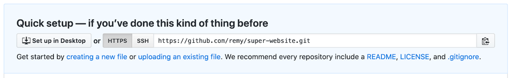
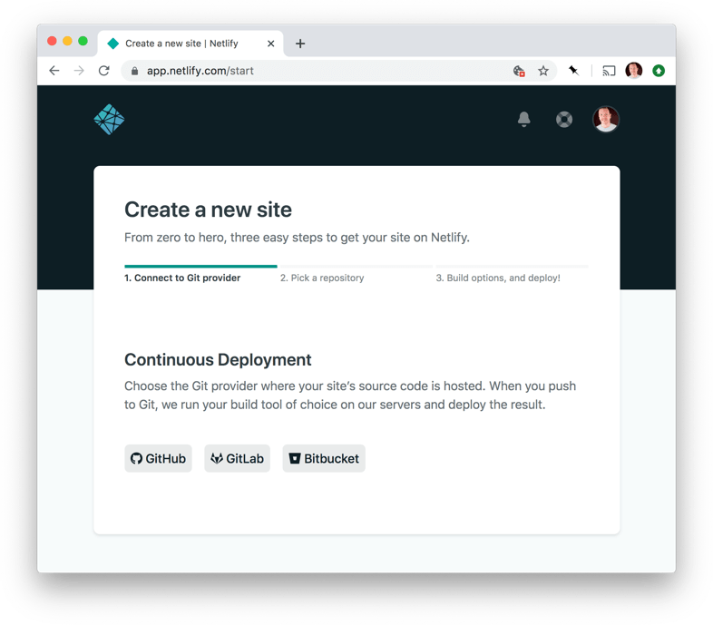
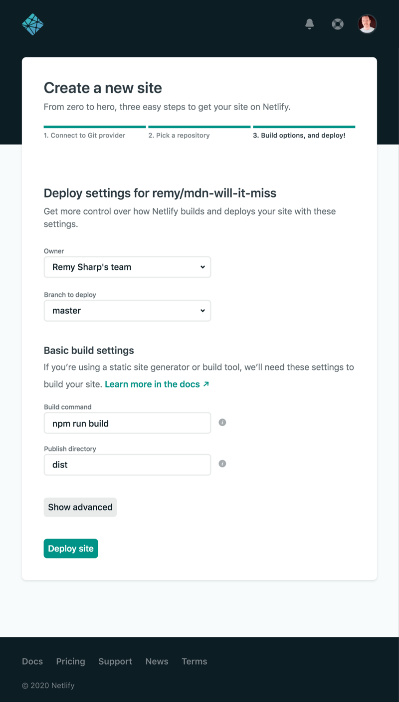

{{LearnSidebar}}{{PreviousMenu("Learn/Tools_and_testing/Understanding_client-side_tools/Introducing_complete_toolchain", "Learn/Tools_and_testing/Understanding_client-side_tools")}}

시리즈의 마지막 글에서는 이전 글에서 구축한 예제 툴체인에 샘플 앱을 배포할 수 있도록 추가합니다. 코드를 GitHub에 푸시하고, Netlify를 사용하여 배포하고, 프로세스에 간단한 테스트를 추가하는 방법까지 보여드리겠습니다.

<table>
  <tbody>
    <tr>
      <th scope="row">전제 조건:</th>
      <td>
        핵심 <a href="/ko/docs/Learn/HTML">HTML</a>,
        <a href="/ko/docs/Learn/CSS">CSS</a> 및
        <a href="/ko/docs/Learn/JavaScript">JavaScript</a> 언어에 익숙해야 합니다.
      </td>
    </tr>
    <tr>
      <th scope="row">목표:</th>
      <td>
        앱 배포에 중점을 둔 전체 툴체인 사례 연구를 완료합니다.
      </td>
    </tr>
  </tbody>
</table>

## 개발 후

프로젝트 라이프사이클의 이 단계에서는 해결해야 할 문제가 많을 수 있습니다. 따라서 가능한 한 수동 개입을 최소화하는 방식으로 이러한 문제를 처리하는 툴체인을 만드는 것이 중요합니다.

다음은 이 특정 프로젝트에서 고려해야 할 몇 가지 사항입니다:

- 프로덕션 빌드 생성: 파일을 최소화하고, 청크하고, 트리 쉐이킹을 적용하고, 버전이 "캐시 버스트"되는지 확인합니다.
- 테스트 실행: "이 코드의 형식이 제대로 되어 있는가?"부터 "이 코드가 내가 예상한 대로 작동하는가?"까지 다양한 테스트를 수행하며, 테스트에 실패하면 배포를 방지할 수 있습니다.
- 업데이트된 코드를 실제 URL에 실제로 배포합니다: 또는 먼저 검토할 수 있도록 스테이징 URL에 배포할 수도 있습니다.

> **참고:** 캐시 버스팅은 이 모듈에서 처음 접하는 새로운 용어입니다. 이는 브라우저의 자체 캐싱 메커니즘을 파괴하여 브라우저가 코드의 새 사본을 다운로드하도록 하는 전략입니다. Parcel(그리고 실제로 다른 많은 도구)은 새 빌드마다 고유한 파일 이름을 생성합니다. 이 고유한 파일명은 브라우저의 캐시를 "파괴"하여 배포된 코드가 업데이트될 때마다 브라우저가 새로운 코드를 다운로드하도록 합니다.

위의 작업은 더 세부적인 작업으로 나뉘며, 대부분의 웹 개발팀은 개발 후 단계의 적어도 일부에 대해 자체적인 용어와 프로세스를 가지고 있습니다.

이 프로젝트에서는 [Netlify](https://www.netlify.com/) 의 훌륭한 정적 호스팅 서비스를 사용하여 프로젝트를 호스팅할 것입니다. Netlify는 호스팅, 더 구체적으로는 프로젝트를 온라인으로 보고 친구, 가족 및 동료와 공유할 수 있는 URL을 제공합니다.

호스팅에 배포하는 것은 프로젝트 수명 주기의 마지막에 하는 경향이 있지만, Netlify와 같은 서비스를 사용하면 배포 비용(재정적 측면과 실제 배포에 필요한 시간 모두)을 낮출 수 있으므로 개발 중에 배포하여 진행 중인 작업을 공유하거나 다른 용도로 사전 릴리스를 할 수 있습니다.

무엇보다도 Netlify를 사용하면 사전 배포 작업을 실행할 수도 있는데, 이 경우 모든 프로덕션 코드 빌드 프로세스를 Netlify 내에서 수행할 수 있으며 빌드가 성공하면 웹사이트 변경 사항이 배포됩니다.

Netlify는 [드래그 앤 드롭 배포 서비스](https://app.netlify.com/drop) 를 제공하지만, GitHub 리포지토리에 푸시할 때마다 Netlify에 새 배포를 트리거하려고 합니다.

자체 빌드 툴체인을 결정할 때 이러한 종류의 커넥티드 서비스를 고려하는 것이 좋습니다. 코드를 커밋하고 GitHub에 푸시하면 업데이트된 코드가 자동으로 전체 빌드 루틴을 트리거합니다. 모든 것이 잘되면 자동으로 라이브 변경 사항이 배포됩니다. 우리가 수행해야 하는 유일한 작업은 초기 "푸시"입니다.

하지만 이러한 단계를 설정해야 하므로 지금부터 살펴보겠습니다.

## 빌드 프로세스

다시 말하지만, 개발용으로 Parcel을 사용하기 때문에 빌드 옵션은 매우 간단하게 추가할 수 있습니다. 서버를 `npx parcel src/index.html`로 실행하는 대신 `npx parcel build src/index.html`로 실행하면 개발 및 테스트 목적으로만 실행하는 것이 아니라 Parcel이 프로덕션에 사용할 수 있는 모든 것을 빌드합니다. 여기에는 코드의 축소 및 트리 쉐이킹, 파일 이름에 대한 캐시 버스팅이 포함됩니다.

새로 생성된 프로덕션 코드는 웹사이트 실행에 필요한 모든 파일이 포함된 `dist`라는 새 디렉터리에 배치되어 서버에 업로드할 준비가 됩니다.

하지만 이 단계를 수동으로 수행하는 것이 최종 목표는 아니며, 빌드가 자동으로 수행되고 `dist` 디렉터리의 결과가 웹사이트에 실시간으로 배포되는 것을 원합니다.

따라서 코드, GitHub 및 Netlify가 서로 통신할 수 있도록 설정해야 하며, 이를 통해 GitHub 코드 저장소를 업데이트할 때마다 Netlify가 자동으로 변경 사항을 가져와 빌드 작업을 실행하고 마지막으로 새 업데이트를 릴리스할 수 있습니다.

`package.json` 파일에 빌드 명령을 npm 스크립트로 추가하여 `npm run build` 명령이 빌드 프로세스를 트리거하도록 하겠습니다. 이 단계가 반드시 필요한 것은 아니지만, 설정하는 습관을 들이면 모든 프로젝트에서 각 프로젝트의 특정 빌드 명령 인수를 기억할 필요 없이 항상 `npm run build`를 사용하여 전체 빌드 단계를 수행할 수 있으므로 좋은 모범 사례입니다.

1. 프로젝트의 루트 디렉터리에서 `package.json` 파일을 열고 `scripts` 속성을 찾습니다.
2. 코드를 빌드하기 위해 실행할 수 있는 `build` 명령을 추가하겠습니다. 이제 프로젝트에 다음 줄을 추가합니다:

   ```json
   "scripts": {
     // …
     "build": "parcel build src/index.html"
   }
   ```

   > **참고:** `scripts` 속성에 이미 명령이 있는 경우 끝에 쉼표를 넣으세요. JSON을 유효하게 유지하세요.

3. 이제 프로젝트 디렉터리 루트에서 다음 명령을 실행하여 프로덕션 빌드 단계를 실행할 수 있습니다(필요한 경우 먼저 <kbd>Ctrl</kbd> + <kbd>C</kbd>로 실행 중인 프로세스를 종료하세요):

   ```bash
   npm run build
   ```

   그러면 다음과 같은 출력이 표시되며, 생성된 프로덕션 파일, 파일 크기 및 빌드에 걸린 시간을 확인할 수 있습니다:

   ```bash
   dist/src.99d8a31a.js.map       446.15 KB     63ms
   dist/src.99d8a31a.js           172.51 KB    5.55s
   dist/stars.7f1dd035.svg          6.31 KB    145ms
   dist/asteroid2.3ead4904.svg      3.51 KB    155ms
   dist/asteroid1.698d75e9.svg       2.9 KB    153ms
   dist/src.84f2edd1.css.map        2.57 KB      3ms
   dist/src.84f2edd1.css            1.25 KB    1.53s
   dist/bg.084d3fd3.svg               795 B    147ms
   dist/index.html                    354 B    944ms
   ```

   지금 사용해 보세요!

이 프로젝트의 인스턴스를 직접 만들려면 이 프로젝트의 코드를 자체 Git 리포지토리에 호스팅해야 합니다. 다음 단계는 프로젝트를 GitHub에 푸시하는 것입니다.

## GitHub에 변경 사항 커밋하기

이 섹션에서는 코드를 Git 리포지토리에 저장하는 단계까지 안내하지만, Git 튜토리얼과는 거리가 멉니다. 훌륭한 튜토리얼과 책이 많이 있으며, [Git 및 GitHub](/ko/docs/Learn/Tools_and_testing/GitHub) 페이지는 시작하기 좋은 곳입니다.

앞서 작업 디렉터리를 git 작업 디렉터리로 초기화했습니다. 이를 확인하는 빠른 방법은 다음 명령을 실행하는 것입니다:

```bash
git status
```

어떤 파일이 추적되고 있는지, 어떤 파일이 스테이징되어 있는지 등 git 문법의 일부인 모든 용어에 대한 상태 보고서가 표시되어야 합니다. `fatal: not a git repository`가 오류가 반환되면 작업 디렉터리가 git 작업 디렉터리가 아니므로 `git init`을 사용하여 git을 초기화해야 합니다.

이제 세 가지 작업이 남았습니다:

- 스테이지(git이 파일을 커밋할 위치의 특별한 이름)에 변경한 내용을 추가합니다.
- 리포지토리에 변경 사항을 커밋합니다.
- 변경 사항을 GitHub에 푸시합니다.

1. 변경 사항을 추가하려면 다음 명령을 실행합니다:

   ```bash
   git add .
   ```

   끝에 마침표는 "이 디렉터리에 있는 모든 것"을 의미합니다. `git add .` 명령은 작업한 모든 로컬 변경 내용을 한 번에 추가하므로 약간 망치 같은 접근 방식입니다. 추가하는 내용을 더 세밀하게 제어하고 싶다면 대화형 프로세스를 위해 `git add -p`를 사용하거나 `git add 대상경로/파일`을 사용하여 개별 파일을 추가하세요.

2. 이제 모든 코드가 스테이지되었으므로 커밋할 수 있습니다. 다음 명령을 실행하세요:

   ```bash
   git commit -m 'committing initial code'
   ```

   > **참고:** 커밋 메시지에 원하는 내용을 자유롭게 작성할 수 있지만, 웹에서 좋은 커밋 메시지에 대한 몇 가지 유용한 팁을 찾을 수 있습니다. 커밋 메시지는 짧고 간결하며 설명적으로 작성하여 변경 내용을 명확하게 설명해야 합니다.

3. 마지막으로 코드를 GitHub 호스팅 리포지토리에 푸시해야 합니다. 지금 바로 해봅시다.

   GitHub(<https://github.com/new>)를 방문하여 이 코드를 호스팅할 리포지토리를 직접 만드세요.

4. 리포지토리에 공백 없이 기억하기 쉬운 짧은 이름(하이픈을 사용하여 단어를 구분)과 설명을 입력한 다음 페이지 하단의 리포지토리 만들기를 클릭합니다.

   이제 새 GitHub 리포지토리를 가리키는 "remote" URL이 생겼을 것입니다.

   

5. 이 원격 위치를 로컬 Git 리포지토리에 추가해야 푸시할 수 있으며, 그렇지 않으면 찾을 수 없습니다. 다음 구조의 명령을 실행해야 합니다(특히 GitHub를 처음 사용하는 경우 SSH 옵션이 아닌 제공된 HTTPS 옵션을 사용하세요):

   ```bash
   git remote add github https://github.com/yourname/repo-name.git
   ```

   따라서 위의 스크린샷에서와 같이 원격 URL이 `https://github.com/remy/super-website.git` 인 경우 명령은 다음과 같습니다.

   ```bash
   git remote add github https://github.com/remy/super-website.git
   ```

   URL을 자신의 리포지토리로 변경하고 지금 실행하세요.

6. 이제 코드를 GitHub에 푸시할 준비가 되었으니 다음 명령을 실행하세요:

   ```bash
   git push github main
   ```

   이 시점에서 Git에서 푸시 전송을 허용하기 전에 사용자 이름과 비밀번호를 입력하라는 메시지가 표시됩니다. 이는 앞의 스크린샷에서 볼 수 있듯이 SSH 옵션이 아닌 HTTPS 옵션을 사용했기 때문입니다. 이를 위해서는 GitHub 사용자 이름과 2단계 인증(2FA)을 켜지 않은 경우 GitHub 비밀번호가 필요합니다. 가능하면 항상 2FA를 사용하는 것이 좋지만, 2FA를 사용하는 경우에는 '개인 액세스 토큰'도 사용해야 한다는 점에 유의하세요. GitHub 도움말 페이지에 [개인 액세스 토큰을 얻는 방법에 대한 훌륭하고 간단한 안내](https://docs.github.com/en/authentication/keeping-your-account-and-data-secure/creating-a-personal-access-token) 가 있습니다.

> **참고:** SSH 옵션을 사용하여 GitHub에 푸시할 때마다 사용자 이름과 비밀번호를 입력할 필요가 없도록 하려면 [이 튜토리얼에서 방법을 안내해](https://docs.github.com/en/authentication/connecting-to-github-with-ssh) 드립니다.

이 마지막 명령은 브랜치 `main`을 사용하여 코드를 `github`(github.com에서 호스팅되는 리포지토리 - 원하는 이름으로 불러도 됨)이라고 부르는 "원격" 위치로 푸시(일명 게시)하도록 git에 지시합니다. 브랜치를 전혀 사용해 본 적은 없지만, "main" 브랜치는 우리 작업의 기본 위치이며 git이 시작되는 곳이기도 합니다. 또한 Netlify가 찾을 기본 브랜치이기도 해서 편리합니다.

> **참고:** 2020년 10월까지 GitHub의 기본 브랜치는 `master` 브랜치였으나 여러 가지 사회적 이유로 `main` 브랜치로 전환되었습니다. 이 이전 기본 브랜치는 다양한 프로젝트에 표시될 수 있지만, 자신의 프로젝트에는 `main` 브랜치를 사용하는 것이 좋습니다.

이제 프로젝트가 git에 커밋되고 GitHub 저장소에 푸시되었으므로 툴체인의 다음 단계는 프로젝트를 웹에 실시간으로 배포할 수 있도록 GitHub를 Netlify에 연결하는 것입니다!

## 배포를 위해 Netlify 사용

특히 이 프로젝트와 같은 "정적 웹 사이트"의 경우 단계를 알고 나면 GitHub에서 Netlify로 배포하는 것은 의외로 간단합니다.

> **참고:** 개발 워크플로우를 개선하는 데 도움이 되는 많은 [가이드와 튜토리얼도 Netlify에](https://www.netlify.com/blog/tags/tutorial/) 있습니다.

시작해 보세요:

1. <https://app.netlify.com/start> 으로 이동합니다.
2. 지속적 배포 제목 아래에 있는 GitHub 버튼을 누릅니다. "지속적 배포"는 코드 저장소가 변경될 때마다 Netlify가 코드를 배포하려고 시도하므로 "지속적"이라는 의미입니다.

   

3. 이전에 Netlify를 승인했는지 여부에 따라 GitHub에서 Netlify를 승인해야 할 수도 있으며, 승인할 계정을 선택해야 할 수도 있습니다(여러 GitHub 계정 또는 조직이 있는 경우). 프로젝트를 푸시한 계정을 선택합니다.
4. Netlify가 찾을 수 있는 GitHub 리포지토리 목록을 표시합니다. 프로젝트 리포지토리를 선택하고 다음 단계로 진행합니다.
5. Netlify를 GitHub 계정에 연결하고 프로젝트 리포지토리를 배포할 수 있는 액세스 권한을 부여했으므로 Netlify는 배포를 위해 프로젝트를 준비하는 방법과 배포할 내용을 묻습니다.

   빌드 명령에 `npm run build` 명령을 입력하고, 게시 디렉터리에 공개하려는 코드가 포함된 `dist` 디렉터리를 지정해야 합니다.

6. 완료하려면 사이트 배포를 클릭합니다.

   

7. 배포가 완료될 때까지 잠시 기다리면 게시된 사이트를 볼 수 있는 URL을 받게 됩니다. 지금 바로 시도해 보세요!
8. 더 좋은 점은 변경을 수행하고 변경 사항을 원격 git 저장소(GitHub)에 푸시할 때마다 Netlify에 알림이 트리거되고 지정된 빌드 작업을 실행한 다음 결과 `dist` 디렉터리를 게시된 사이트에 배포한다는 점입니다.

   지금 바로 시도해 보세요. 앱을 약간 변경한 다음 다음 명령을 사용하여 GitHub에 푸시하세요:

   ```bash
   git add .
   git commit -m 'simple netlify test'
   git push github main
   ```

   게시된 사이트가 변경 사항으로 업데이트되는 것을 볼 수 있을 것입니다. 게시하는 데 몇 분 정도 걸릴 수 있으므로 조금만 기다려주세요.

여기까지 Netlify에 대한 설명이 끝났습니다. 선택적으로 Netlify 프로젝트의 이름을 변경하거나 자체 도메인 이름을 사용하도록 지정할 수 있으며, 이에 대한 [훌륭한 문서](https://docs.netlify.com/) 도 Netlify에서 제공합니다.

이제 툴체인의 마지막 링크인 코드가 작동하는지 확인하는 테스트가 남았습니다.

## 테스트

테스트 자체는 프론트엔드 개발 영역에서도 방대한 주제입니다. 프로젝트에 초기 테스트를 추가하는 방법과 테스트를 사용하여 프로젝트 배포를 방지하거나 허용하는 방법을 보여드리겠습니다.

테스트에 접근할 때 문제에 접근하는 방법에는 여러 가지가 있습니다:

- 엔드투엔드 테스트는 방문자가 무언가를 클릭하고 다른 일이 발생하는 것을 포함합니다.
- 통합 테스트: 기본적으로 "한 코드 블록이 다른 블록에 연결되었을 때 여전히 작동하는가?"를 테스트합니다.
- 단위 테스트: 작고 구체적인 기능을 테스트하여 해당 기능이 제대로 작동하는지 확인합니다.
- [그 외에도 다양한 유형](https://en.wikipedia.org/wiki/Functional_testing) 이 있습니다. 또한 [크로스 브라우저 테스트 모듈](/ko/docs/Learn/Tools_and_testing/Cross_browser_testing) 에서 유용한 테스트 정보를 확인할 수 있습니다.

테스트는 자바스크립트에만 국한되지 않으며 렌더링된 DOM, 사용자 상호작용, CSS, 심지어 페이지가 어떻게 보이는지에 대해서도 테스트를 실행할 수 있다는 점도 기억하세요.

하지만 이 프로젝트에서는 타사 NASA 데이터 피드를 확인하고 올바른 형식인지 확인하는 작은 테스트를 만들겠습니다. 그렇지 않은 경우 테스트가 실패하고 프로젝트가 시작되지 않습니다. 다른 작업을 하는 것은 이 모듈의 범위를 벗어나는 것이므로 테스트는 별도의 모듈이 필요할 정도로 방대한 주제입니다. 이 섹션을 통해 최소한 테스트의 필요성을 인식하고 더 많은 것을 배우고자 하는 씨앗을 심을 수 있기를 바랍니다.

이 프로젝트의 테스트에는 테스트 프레임워크가 포함되어 있지 않지만, 프론트엔드 개발 세계의 모든 것과 마찬가지로 수많은 [프레임워크 옵션](https://www.npmjs.com/search?q=keywords%3Atesting) 이 있습니다.

테스트 자체가 중요한 것은 아닙니다. 중요한 것은 실패 또는 성공이 처리되는 방식입니다. 일부 배포 플랫폼은 파이프라인의 일부로 특정 테스트 방법을 포함합니다. GitHub, GitLab 등과 같은 제품은 모두 개별 커밋에 대한 테스트 실행을 지원합니다.

이 프로젝트는 Netlify에 배포하는 프로젝트이고 Netlify는 빌드 명령에 대해서만 묻기 때문에 테스트를 빌드의 일부로 만들어야 합니다. 테스트가 실패하면 빌드가 실패하고 Netlify가 배포되지 않습니다.

시작하겠습니다.

1. `package.json` 파일로 이동하여 엽니다.
2. `scripts` 멤버를 찾아서 다음 테스트 및 빌드 명령이 포함되도록 업데이트합니다:

   ```json
   "scripts": {
     …
     "test": "node tests/*.js",
     "build": "npm run test && parcel build src/index.html"
   }
   ```

3. 이제 코드베이스에 테스트를 추가해야 하므로 루트 디렉터리에 tests라는 새 디렉터리를 생성합니다:

   ```bash
   mkdir tests
   ```

4. 새 디렉토리 안에 테스트 파일을 생성합니다:

   ```bash
   cd tests
   touch nasa-feed.test.js
   ```

5. 이 파일을 열고 [nasa-feed.test.js](https://raw.githubusercontent.com/remy/mdn-will-it-miss/master/tests/nasa-feed.test.js) 의 내용을 추가합니다:
6. 이 테스트는 axios 패키지를 사용하여 테스트할 데이터 피드를 가져오며, 이 종속성을 설치하려면 다음 명령을 실행합니다:

   ```bash
   npm install --save-dev axios
   ```

   Parcel이 이 종속성을 지원하지 않으므로 수동으로 axios를 설치해야 합니다. 테스트는 Parcel이 우리 시스템을 볼 수 없는 외부에 있으므로, Parcel은 테스트 코드를 보거나 실행하지 않으므로 종속성을 직접 설치해야 합니다.

7. 이제 수동으로 테스트를 실행하려면 명령줄에서 다음과 같이 실행할 수 있습니다:

   ```bash
   npm run test
   ```

   성공하면 결과는... 아무것도 없습니다. 이것은 성공으로 간주됩니다. 일반적으로 테스트는 문제가 있는 경우에만 노이즈가 발생하기를 원합니다. 또한 테스트는 명령줄에 성공했음을 알려주는 특별한 신호(종료 신호 0)와 함께 종료됩니다. 실패한 경우 테스트는 종료 코드 1과 함께 실패하며, 이는 시스템 수준 값으로 "무언가 실패했습니다"라는 의미입니다.

   `npm run test` 명령은 node를 사용하여 테스트 디렉터리에 있는 `.js`로 끝나는 모든 파일을 실행합니다.

   빌드 스크립트에서 `npm run test`를 호출하면 `&&` 문자열이 표시되는데, 이는 "왼쪽의 작업이 성공하면(0으로 종료되면) 오른쪽에서 이 작업을 수행한다"는 의미입니다. 즉, 테스트가 통과하면 코드를 빌드하라는 의미로 해석할 수 있습니다.

8. 이전에 사용한 것과 유사한 명령을 사용하여 새 코드를 GitHub에 업로드해야 합니다:

   ```bash
   git add .
   git commit -m 'adding test'
   git push github main
   ```

   경우에 따라 빌드된 코드의 결과를 테스트하고 싶을 수 있으므로(원래 작성한 코드가 아니므로) 빌드 명령 후에 테스트를 실행해야 할 수도 있습니다. 프로젝트를 진행하면서 이러한 모든 개별적인 측면을 고려해야 합니다.

이제 마지막으로 푸시한 후 1분 정도 지나면 Netlify가 프로젝트 업데이트를 배포합니다. 하지만 앞서 소개한 테스트를 통과한 경우에만 배포됩니다.

## 요약

여기까지 샘플 사례 연구와 모듈에 대한 설명이 끝났습니다! 도움이 되셨기를 바랍니다. 클라이언트 측 툴링 마법사라고 생각하기에는 아직 갈 길이 멀지만, 이 모듈을 통해 클라이언트 측 툴링을 이해하는 중요한 첫걸음을 내딛고 더 많은 것을 배우고 새로운 것을 시도해 볼 수 있는 자신감을 얻으셨기를 바랍니다.

이제 툴체인의 모든 부분을 요약해 보겠습니다:

- 코드 품질 및 유지 관리는 ESLint와 Prettier가 수행합니다. 이러한 도구는 `npm install --dev eslint prettier eslint-plugin-react`를 통해 프로젝트에 `devDependency`로 추가됩니다(이 특정 프로젝트는 React를 사용하므로 ESLint 플러그인이 필요합니다).
- 코드 품질 도구가 읽는 구성 파일은 `.eslintrc`와 `.prettierrc` 두 가지입니다.
- 개발 중에는 Parcel을 사용하여 종속성을 처리하고, 변경 사항을 감시하고 소스를 자동으로 빌드하기 위해 백그라운드에서 `parcel src/index.html`을 실행합니다.
- 배포는 변경 사항을 GitHub("main" 브랜치)에 푸시하여 처리하며, 이 푸시는 Netlify에서 빌드 및 배포를 트리거하여 프로젝트를 게시합니다. 이 예의 경우 이 URL은 [near-misses.netlify.com](https://near-misses.netlify.app/) 이며, 여러분은 고유한 URL을 갖게 됩니다.
- 또한 NASA API 피드가 올바른 데이터 형식을 제공하지 않는 경우 사이트 빌드 및 배포를 차단하는 간단한 테스트도 있습니다.

도전을 원하시는 분들은 이 툴체인의 일부를 최적화할 수 있는지 고려해 보세요. 스스로에게 물어볼 몇 가지 질문이 있습니다:

- 빌드 단계에서 [이미지를 압축할](https://github.com/ralscha/parcel-plugin-compress) 수 있는가?
- React를 [더 작은 것](https://preactjs.com/) 으로 교체할 수 있을까요?
- [성능 감사](https://web.dev/lighthouse-performance/) 와 같은 테스트를 추가하여 잘못된 빌드가 배포되는 것을 방지할 수 있나요?
- 새 배포가 성공하거나 실패했을 때 알려주는 알림을 설정할 수 있나요?

{{PreviousMenu("Learn/Tools_and_testing/Understanding_client-side_tools/Introducing_complete_toolchain", "Learn/Tools_and_testing/Understanding_client-side_tools")}}
