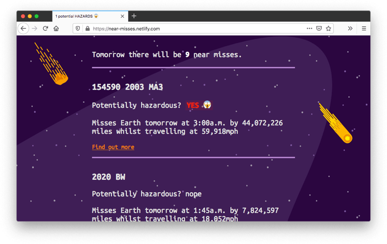
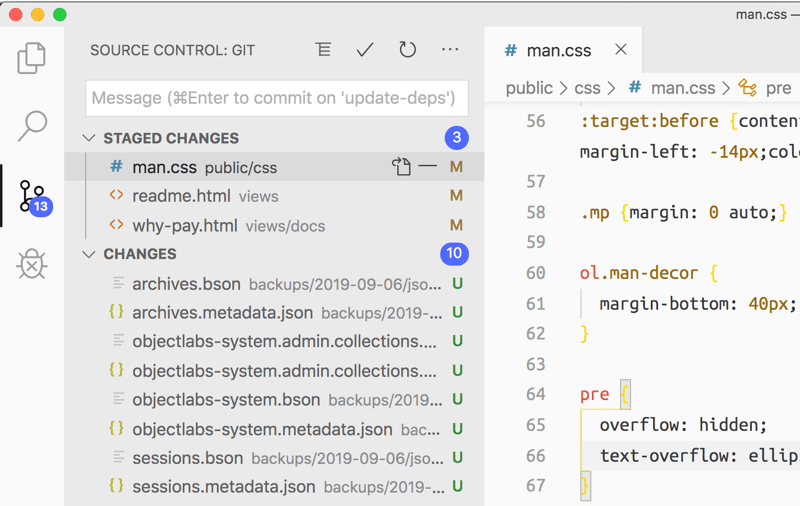
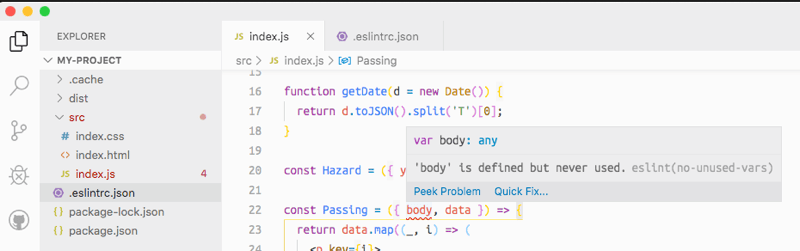
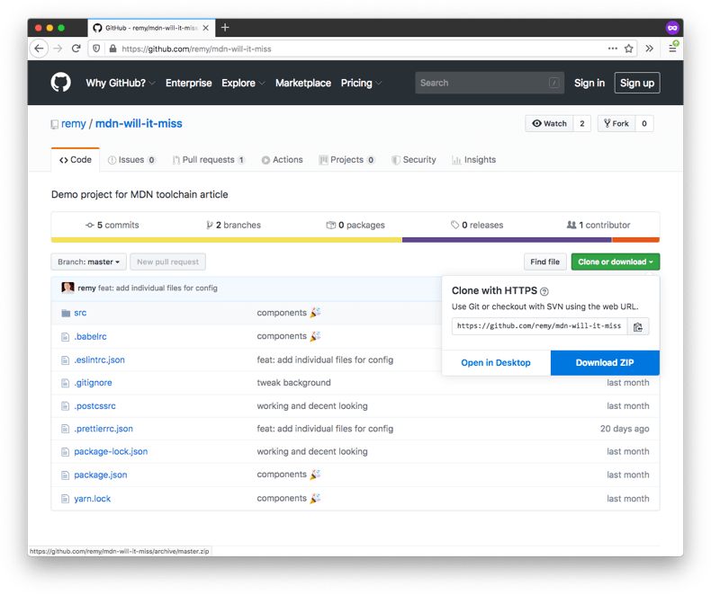

{{LearnSidebar}}{{PreviousMenuNext("Learn/Tools_and_testing/Understanding_client-side_tools/Package_management","Learn/Tools_and_testing/Understanding_client-side_tools/Deployment", "Learn/Tools_and_testing/Understanding_client-side_tools")}}

시리즈의 마지막 두 글에서는 샘플 사례 연구 툴체인을 구축하는 과정을 안내하여 툴링 지식을 탄탄하게 다질 것입니다. 합리적인 개발 환경을 설정하고 변환 도구를 배치하는 것부터 실제로 Netlify에 앱을 배포하는 것까지 모든 과정을 살펴볼 것입니다. 이 글에서는 사례 연구 소개, 개발 환경 설정, 코드 변환 도구 설정에 대해 설명합니다.

<table>
  <tbody>
    <tr>
      <th scope="row">전제 조건:</th>
      <td>
        핵심 <a href="/ko/docs/Learn/HTML">HTML</a>,
        <a href="/ko/docs/Learn/CSS">CSS</a> 및
        <a href="/ko/docs/Learn/JavaScript">JavaScript</a> 언어에 익숙해야 합니다.
      </td>
    </tr>
    <tr>
      <th scope="row">목표:</th>
      <td>
        완전한 툴체인 사례 연구를 통해 지금까지 배운 내용을 공고히 합니다.
      </td>
    </tr>
  </tbody>
</table>

실제로 도구와 도구의 조합과 사용 방법은 무궁무진하며, 이 글과 다음 글에서 소개하는 도구는 프로젝트에 사용할 수 있는 한 가지 방법일 뿐입니다.

> **참고::** 이 모든 도구를 명령줄에서 실행할 필요는 없다는 점도 다시 한 번 강조하고 싶습니다. 오늘날 많은 코드 편집기(예: VS Code 및 Atom)는 플러그인을 통해 많은 도구에 대한 통합을 지원합니다.

## 사례 연구 소개

이 글에서 만드는 툴체인은 지구에서 우리의 존재를 위협하는 잠재적으로 위험한 우주 물체에 관한 데이터([NASA의 오픈 API](https://api.nasa.gov/) 중 하나에서 가져온)를 나열하는 미니 사이트를 구축하고 배포하는 데 사용될 것입니다! 미니 사이트는 다음과 같습니다:



사이트의 라이브 버전은 [near-misses.netlify.com](https://near-misses.netlify.app/) 에서 확인할 수 있습니다.

## 도구 체인에 사용되는 도구

이 문서에서는 다음과 같은 도구와 기능을 사용할 것입니다:

- [JSX](https://reactjs.org/docs/introducing-jsx.html): 자바스크립트 내에서 컴포넌트 구조를 정의하는 등의 작업을 수행할 수 있는 [React](https://reactjs.org) 관련 구문 확장 세트입니다. 이 튜토리얼을 따라하기 위해 React를 알 필요는 없지만, 네이티브가 아닌 웹 언어가 어떻게 툴체인에 통합될 수 있는지에 대한 아이디어를 제공하기 위해 이 기능을 포함했습니다.
- [`import`](/ko/docs/Web/JavaScript/Reference/Statements/import) 와 같은 최신 내장 JavaScript 기능(작성 시점 기준).
- 포맷팅을 위한 [Prettier](https://prettier.io/), 린팅을 위한 [ESLint](https://eslint.org/) 와 같은 유용한 개발 도구.
- CSS 중첩 기능을 제공하는 [PostCSS](https://postcss.org/).
- 코드를 빌드 및 축소하고 여러 구성 파일 콘텐츠를 자동으로 작성하는 [Parcel](https://parceljs.org/).
- 소스 코드 제어를 관리하기 위한 [GitHub](/ko/docs/Learn/Tools_and_testing/GitHub).
- 배포 프로세스를 자동화하는 [Netlify](https://www.netlify.com/).

위의 모든 기능과 도구가 익숙하지 않거나 어떤 기능을 하는지 잘 모르실 수도 있지만, 당황하지 마세요. 이 글을 진행하면서 각 부분을 설명해 드릴 테니까요.

## 툴체인과 그 고유의 복잡성

다른 체인과 마찬가지로 툴체인에 링크가 많을수록 더 복잡하고 잠재적으로 취약해질 수 있습니다. 예를 들어 구성이 더 복잡하고 쉽게 끊어질 수 있습니다. 반대로 링크가 적을수록 툴체인의 복원력이 높아질 가능성이 높습니다.

웹 프로젝트는 모두 다르므로 툴체인에서 어떤 부분이 필요한지 고려하고 각 부분을 신중하게 고려해야 합니다.

가장 작은 툴체인은 링크가 전혀 없는 툴체인입니다. HTML을 직접 코딩하고, 프레임워크나 중개 언어가 없는 "바닐라 자바스크립트"를 사용하고, 호스팅을 위해 모든 것을 서버에 수동으로 업로드할 수 있습니다.

그러나 소프트웨어 요구 사항이 더 복잡한 경우에는 개발 프로세스를 간소화하는 데 도움이 되는 도구를 사용하는 것이 좋습니다. 또한 프로덕션 서버에 배포하기 전에 테스트를 수행하여 소프트웨어가 의도한 대로 작동하는지 확인해야 하는데, 이는 이미 필수적인 툴체인처럼 들립니다.

샘플 프로젝트에서는 소프트웨어 개발을 돕고 소프트웨어 설계 단계에서 내린 기술적 선택을 지원하기 위해 특별히 설계된 도구 체인을 사용할 것입니다. 하지만 복잡성을 최소화하기 위해 불필요한 도구는 사용하지 않을 것입니다.

예를 들어, 빌드 과정에서 SVG 파일 크기를 최소화하는 도구를 포함할 수도 있었습니다. 하지만 이 프로젝트에는 SVG 이미지가 4개뿐이며, 프로젝트에 추가하기 전에 [SVGO를 사용하여 수동으로 축소](https://www.npmjs.com/package/svgo) 했습니다.

## 몇 가지 전제 조건

툴체인에 기여할 도구를 설치하는 것 외에도 위의 도구 목록에서 두 가지 웹 서비스를 언급했습니다. 계속하기 전에 이 기회에 이 두 가지를 설정했는지 확인해 보겠습니다. 튜토리얼을 완료하려면 GitHub와 Netlify 각각에 계정을 만들어야 합니다.

- 앞서 언급했듯이 GitHub는 이슈 추적, 프로젝트 릴리스 팔로우 등의 커뮤니티 기능을 추가하는 소스 코드 리포지토리 서비스입니다. 다음 장에서는 모든 소프트웨어를 웹의 홈에 배포하는 캐스케이드 효과를 유발하는 GitHub 코드 저장소로 푸시할 것입니다.
- Netlify는 정적 웹사이트(즉, 실시간으로 변경되지 않는 파일로만 구성된 웹사이트)를 위한 호스팅 서비스로, 하루에 여러 번 배포하고 모든 종류의 정적 사이트를 자유롭게 호스팅할 수 있습니다. Netlify는 위에서 언급한 "웹상의 집"을 제공하는 서비스로, 테스트 앱을 배포할 수 있는 무료 호스팅을 제공합니다.

[GitHub](https://github.com/) 에 가입(아직 계정이 없는 경우 홈페이지에서 가입 링크를 클릭하고 지침을 따름)하면 [Netlify](https://www.netlify.com/) 에서 인증에 GitHub 계정을 사용할 수 있으므로(가입을 클릭한 다음 "다음 중 하나로 가입" 목록에서 GitHub를 선택) 기술적으로는 하나의 새 계정만 생성하면 됩니다.

나중에 이 프로젝트를 배포하려면 Netlify 계정을 GitHub 리포지토리에 연결해야 하는데, 다음 장에서 그 방법을 살펴보겠습니다.

## 세 단계의 도구

[1장](/ko/docs/Learn/Tools_and_testing/Understanding_client-side_tools/Overview) 에서 설명한 것처럼 툴체인은 다음 단계로 구성됩니다:

- **안전망**: 소프트웨어 개발 환경을 안정적이고 효율적으로 만드는 단계입니다. 이를 개발 환경이라고도 할 수 있습니다.
- **변환**: 개발 프로세스에서 특정 언어(예: JavaScript)의 최신 기능 또는 다른 언어(예: JSX 또는 TypeScript)를 완전히 사용할 수 있게 해주는 도구로, 프로덕션 버전이 최신 및 구형 브라우저를 포함한 다양한 브라우저에서 계속 실행되도록 코드를 변환합니다.
- **개발 후**: 개발 본문을 완료한 후 소프트웨어가 웹에 배포되고 계속 실행되도록 하기 위해 사용되는 도구입니다. 이 사례 연구에서는 코드에 테스트를 추가하고 모든 웹에서 볼 수 있도록 Netlify를 사용하여 앱을 배포하는 방법을 살펴봅니다.

개발 환경부터 시작해 보겠습니다.

## 개발 환경 만들기

툴체인의 이 부분은 때때로 실제 작업을 지연시키는 것으로 보이며, 환경을 "제대로" 만들기 위해 많은 시간을 소비하는 도구의 "토끼 구멍"에 빠지기 쉽습니다.

하지만 이를 실제 작업 환경을 설정하는 것과 같은 방식으로 볼 수 있습니다. 의자는 편안해야 하고 자세에 도움이 되는 좋은 위치에 설치해야 합니다. 전원, Wi-Fi, USB 포트가 필요합니다! 정신적 안정에 도움이 되는 장식이나 음악이 있을 수도 있는데, 이 모든 것은 최상의 업무 수행을 위해 중요하며 제대로 설치했다면 한 번만 설치하면 됩니다.

마찬가지로 개발 환경을 설정하는 것도 제대로만 하면 한 번만 하면 되고 향후 여러 프로젝트에서 재사용할 수 있어야 합니다. 툴체인의 이 부분을 정기적으로 검토하고 도입해야 할 업그레이드나 변경 사항이 있는지 고려해야 할 수도 있지만 너무 자주 할 필요는 없습니다.

툴체인은 필요에 따라 달라지겠지만, 이 (가능한) 완전한 툴체인의 예시에서는 미리 설치될 도구가 다음과 같습니다:

- 라이브러리 설치 도구 - 종속성 추가용.
- 코드 리비전 제어.
- 코드 정리 도구 - JavaScript, CSS, HTML 정리를 위한 도구입니다.
- 코드 린팅 도구 - 코드 린팅을 위한 도구입니다.

### 라이브러리 설치 도구

2장에서 처음 만났던 npm을 사용해 도구를 설치하겠습니다. Node.js와 npm이 이미 설치되어 있어야 하지만 설치되어 있지 않은 경우 [해당 섹션을 다시 참조하세요](/ko/docs/Learn/Tools_and_testing/Understanding_client-side_tools/Command_line#adding_powerups).

> **참고:** 설치 과정에서는 명확하지 않지만, npm을 설치하면 npx라는 보완 도구도 함께 설치됩니다. 이 장의 뒷부분에서 프로젝트에 로컬 종속성으로 설치된 도구를 실행하는 데 npx를 사용하겠습니다.

npm은 툴체인의 후속 부분을 설치하는 데 사용될 것입니다. 하지만 우선 수정본 관리를 돕기 위해 git을 설치하겠습니다.

### 코드 리비전 제어

"git"에 대해 들어본 적이 있을 것입니다.  [Git](https://git-scm.com/) 은 현재 개발자들이 가장 많이 사용하는 소스 코드 리비전 제어 도구로, 리비전 제어는 원격지에서 작업을 백업할 수 있는 방법, 서로의 코드를 덮어쓸 염려 없이 같은 프로젝트에서 팀으로 작업할 수 있는 메커니즘 등 많은 이점을 제공합니다.

이미 알고 있는 내용일 수도 있지만 반복해서 설명할 필요가 있습니다: Git은 GitHub와 같은 것이 아닙니다. Git은 리비전 제어 도구인 반면, [GitHub](https://github.com/) 는 Git 리포지토리(그리고 리포지토리 작업에 유용한 여러 도구)를 위한 온라인 스토어입니다. 이 장에서는 GitHub를 사용하지만 [GitLab](https://about.gitlab.com/), [Bitbucket](https://www.atlassian.com/software/bitbucket) 등 여러 가지 대안이 있으며, 자체 Git 리포지토리를 호스팅할 수도 있다는 점에 유의하세요.

프로젝트에서 리비전 제어를 사용하고 이를 도구 체인의 일부로 포함하면 코드의 진화를 관리하는 데 도움이 됩니다. 리비전 컨트롤은 진행하면서 작업 블록을 "커밋"하는 방법을 제공하며, "X 새 기능 구현됨" 또는 "Y 변경으로 인해 버그 Z가 수정됨"과 같은 코멘트도 함께 표시할 수 있습니다.

또한 리비전 제어를 사용하면 프로젝트 코드를 브랜치하여 별도의 버전을 만들고, 변경 사항이 원래 코드에 영향을 주지 않으면서 새로운 기능을 시험해 볼 수 있습니다.

마지막으로, 어딘가에서 실수가 발생하여 수정하는 데 문제가 있는 경우 변경 사항을 취소하거나 코드를 "작동하던 시점"으로 되돌릴 수 있습니다. 이는 모든 개발자가 한 번쯤은 해야 하는 일입니다!

Git은 [git-scm 웹사이트를 통해 다운로드하여 설치할](https://git-scm.com/downloads) 수 있습니다. 시스템에 맞는 설치 프로그램을 다운로드하고 실행한 후 화면의 지시를 따르세요. 지금은 이것만 하면 됩니다.

명령줄을 사용하여 명령을 실행하거나, 버튼을 눌러 동일한 명령을 실행하는 [git GUI 앱](https://git-scm.com/downloads/guis) 을 사용하거나, 아래의 Visual Studio 코드 예제에서 볼 수 있듯이 코드 편집기 내에서 직접 실행하는 등 다양한 방법으로 git과 상호작용할 수 있습니다:



어쨌든 지금은 git을 설치하는 것만 하면 됩니다. 계속 진행하겠습니다.

### 코드 정리 도구

이 프로젝트에서는 2장에서 처음 만났던 Prettier를 사용해 코드를 정리하겠습니다. [Prettier 설치하기](/ko/docs/Learn/Tools_and_testing/Understanding_client-side_tools/Command_line#installing_prettier) 섹션의 지침을 따랐다면 이미 Prettier가 설치되어 있을 것입니다. 그렇지 않다면 지금 바로 터미널을 사용하여 글로벌 유틸리티로 Prettier를 설치하도록 하겠습니다.

다음 명령을 사용하여 전역적으로 이미 설치되었는지 확인할 수 있습니다:

```bash
prettier -v
```

설치되어 있다면 2.0.2와 같은 버전 번호가 반환되고, 설치되어 있지 않다면 "명령을 찾을 수 없음"과 같은 문구가 반환됩니다. 이 경우 다음 명령을 사용하여 설치하세요:

```bash
npm install prettier -g
```

이제 Prettier가 설치되었으므로 컴퓨터 어디에서나 명령줄에서 개별 파일 단위로 코드를 실행하고 정리할 수 있습니다:

```bash
prettier --write ./src/index.html
```

> **참고:** 위 명령에서 저는 `--write` 플래그와 함께 Prettier를 사용합니다. Prettier는 이를 "내 코드 형식에 문제가 있는 경우 문제를 수정한 다음 파일을 저장하라"는 의미로 이해합니다. 개발 프로세스에는 괜찮지만 플래그 없이 `prettier`를 사용하면 파일만 검사할 수 있습니다. 파일만 확인하고 저장하지 않는 것은 릴리스 전에 실행하는 검사, 즉 "형식이 올바르게 지정되지 않은 코드는 릴리스하지 마세요"와 같은 목적에 유용합니다.

각 파일에 대해 초기 명령을 실행하는 것은 번거로울 수 있으며, 이 작업을 수행하는 단일 명령이 있으면 유용할 것입니다(린팅 도구도 마찬가지입니다).

이 문제를 해결하는 방법은 여러 가지가 있지만, 여기서는 몇 가지만 소개합니다:

- 다음과 같이 명령줄에서 여러 명령을 한 번에 실행하는 npm 스크립트(예: `npm run tidy-code`)를 사용합니다.
- 커밋하기 전에 코드가 포맷되었는지 테스트하기 위해 특수한 "git hooks"를 사용하기.
- 코드 에디터 플러그인을 사용하여 파일을 저장할 때마다 Prettier 명령을 실행합니다.

> **참고:** 깃 훅이란 무엇인가요? Git(GitHub가 아님)은 Git으로 수행하는 작업(예: 코드 커밋)에 사전 및 사후 작업을 첨부할 수 있는 시스템을 제공합니다. 이 글의 작성자가 보기에 깃 훅은 다소 복잡할 수 있지만, 일단 사용법을 익히면 매우 강력할 수 있습니다. 훅을 사용하는 데 관심이 있다면 [Husky](https://github.com/typicode/husky) 를 사용하면 매우 간단하게 훅을 사용할 수 있다.

VS Code의 경우 유용한 확장 기능 중 하나는 저장 시 자동으로 코드 서식을 지정해주는 [Esben Petersen의 Prettier Code Formatter](https://marketplace.visualstudio.com/items?itemName=esbenp.prettier-vscode) 입니다. 즉, 작업 중인 프로젝트의 모든 파일(HTML, CSS, JavaScript, JSON, 마크다운 등)의 서식이 멋지게 지정됩니다. 에디터에서 "저장 시 서식 지정"만 활성화하면 됩니다.

최근에 만들어진 많은 도구와 마찬가지로 Prettier에는 "합리적인 기본값"이 제공됩니다. 즉, 기본값에 만족한다면 아무것도 설정하지 않고도 Prettier를 사용할 수 있습니다([기본값](https://prettier.io/docs/en/configuration.html) 에 만족한다면). 따라서 중요한 작업, 즉 크리에이티브 작업에 집중할 수 있습니다.

### 코드 린팅 도구

린팅은 코드 품질에 도움이 될 뿐만 아니라 개발 중에 잠재적인 오류를 조기에 발견할 수 있는 방법이기도 합니다. 린팅은 좋은 도구 체인의 핵심 요소이며 많은 개발 프로젝트에 기본적으로 포함되어 있습니다.

웹 개발 린팅 도구는 대부분 자바스크립트용으로 존재합니다(HTML과 CSS용 도구도 몇 가지 있지만). 알 수 없는 HTML 요소나 잘못된 CSS 프로퍼티가 사용되더라도 이 두 언어의 탄력적인 특성으로 인해 문제가 발생할 가능성은 거의 없습니다. 자바스크립트는 훨씬 더 취약합니다. 예를 들어 존재하지 않는 함수를 실수로 호출하면 자바스크립트가 손상될 수 있으므로, 특히 대규모 프로젝트에서는 자바스크립트 린팅이 매우 중요합니다.

자바스크립트 린팅을 위해 가장 많이 사용하는 도구는 [ESLint](https://eslint.org/) 입니다. 매우 강력하고 다재다능한 도구이지만 올바르게 구성하기가 까다로울 수 있으며, 올바른 구성을 위해 많은 시간을 소비할 수 있습니다!

ESLint를 실행하면 기본적으로 구성 파일을 찾을 수 없다는 메시지가 표시됩니다. 구성 파일은 여러 형식을 지원하지만 이 프로젝트에서는 `.eslintrc.json`을 사용합니다(앞의 마침표는 파일이 기본적으로 숨겨져 있음을 의미합니다).

ESLint는 npm을 통해 설치되므로 2장의 설명에 따라 이 도구를 로컬 또는 전역으로 설치할 수 있습니다. 둘 다 사용하는 것이 좋습니다:

- 공유하려는 프로젝트의 경우, 자신의 사본을 만드는 모든 사람이 프로젝트에 적용한 규칙을 따를 수 있도록 항상 ESLint를 로컬 종속 요소로 포함해야 합니다.
- 또한 원하는 파일을 빠르게 확인할 수 있도록 ESLint를 전역적으로 설치하는 것도 고려해야 합니다.

이 장에서는 간단하게 설명하기 위해 ESLint의 모든 기능을 살펴보지는 않겠지만, 특정 프로젝트와 요구 사항에 맞는 구성을 설정하겠습니다. 하지만 코드의 모양(또는 유효성 검사)에 대한 규칙을 세분화하고 적용하려는 경우 올바른 ESLint 구성을 통해 이를 수행할 수 있다는 점을 명심하세요.

이 장의 뒷부분에서 ESLint 구성을 제공하겠습니다. 제대로 된 구성이 완료되면 명령을 실행하면 몇 가지 유용한 정보를 생성할 수 있습니다. 다음은 ESLint 출력 예시입니다:

```bash
./my-project/src/index.js
   2:8 error 'React' is defined but never used  no-unused-vars
 22:20 error 'body' is defined but never used   no-unused-vars
 96:19 error 'b' is defined but never used      no-unused-vars

✖ 3 problems (3 errors, 0 warnings)
```

> **참고:** 다음 섹션에서 ESLint를 설치할 예정이니 지금은 걱정하지 마세요.

다른 도구와 마찬가지로 코드 편집기 통합 지원은 일반적으로 ESLint에 유용하며, 문제가 발생할 때 실시간 피드백을 제공할 수 있으므로 더 유용할 수 있습니다:



## 초기 프로젝트 구성

이러한 도구를 사용하면 많은 "기본적인" 문제를 초기에 발견할 수 있다는 사실을 알고 새 프로젝트를 안전하게 설정할 수 있습니다.

명령줄을 사용하여 프로젝트를 생성하고, 초기 툴을 설치하고, 기본적인 구성 파일을 만들 수 있습니다. 이 과정을 몇 번 반복하면 기본 설정이 어떻게 되어야 하는지 감을 잡을 수 있습니다. 물론 이것은 가능한 구성 중 하나일 뿐입니다.

### 초기 설정

자, 이제 초기 프로젝트 설정을 시작하겠습니다.

1. 먼저 터미널을 열고 쉽게 찾을 수 있는 장소로 이동하여 시작하세요. 데스크톱이나 홈 또는 문서 폴더가 가장 좋겠죠?
2. 그런 다음 다음 명령을 실행하여 프로젝트를 보관할 폴더를 만들고 폴더 안으로 이동합니다:

   ```bash
   mkdir will-it-miss
   cd will-it-miss
   ```

3. 이제 웹사이트의 모든 개발 코드가 저장될 새 디렉터리를 만듭니다. 이제 다음을 실행합니다:

   ```bash
   mkdir src
   ```

   코드 정리는 팀마다 상당히 주관적인 경향이 있습니다. 이 프로젝트의 경우 소스 코드는 `src`에 저장됩니다.

4. `will-it-miss` 디렉터리의 루트 안에 있는지 확인하고 다음 명령을 입력하여 디렉터리에서 작동하는 git의 소스 제어 기능을 시작하세요:

   ```bash
   git init
   ```

   이제 폴더의 내용에 대한 수정 내용을 저장하거나 원격 저장소에 저장하는 등의 작업을 시작할 수 있습니다. 이에 대해서는 나중에 자세히 설명합니다!

5. 다음으로 다음 명령을 입력하여 이전 글에서 설명한 이점을 활용하여 디렉터리를 npm 패키지로 전환합니다:

   ```bash
   npm init --force
   ```

   이렇게 하면 나중에 원하는 경우 구성할 수 있는 기본 `package.json` 파일이 생성됩니다. `--force` 플래그를 사용하면 앞서 살펴본 것처럼 어떤 내용을 포함할지 묻는 일반적인 질문 없이 명령이 기본 `package.json` 파일을 즉시 생성합니다. 지금은 기본값만 필요하므로 시간을 조금 절약할 수 있습니다.

#### 프로젝트 코드 파일 가져오기

이제 프로젝트의 코드 파일(HTML, CSS, JavaScript 등)을 가져와서 `src` 디렉터리에 넣겠습니다. 이 장의 핵심이 아니므로 코드가 어떻게 작동하는지는 설명하지 않겠습니다. 단지 도구를 실행하고 작동 방식을 알려드리기 위한 것입니다.

1. 코드 파일을 받으려면 <https://github.com/remy/mdn-will-it-miss> 을 방문하여 이 저장소의 내용을 로컬 드라이브에 다운로드하고 압축을 풉니다. 복제 또는 다운로드 > ZIP 다운로드를 선택하면 전체 프로젝트를 zip 파일로 다운로드할 수 있습니다.

   

2. 이제 프로젝트의 `src` 디렉토리에 있는 내용을 현재 비어있는 `src` 디렉토리에 복사합니다.

프로젝트 파일이 제자리에 있습니다. 이제 할 일은 여기까지입니다!

> **참고:** 로컬 머신에서 프로젝트를 설정하려면 압축을 푼 폴더의 루트 디렉토리로 이동하여 해당 위치에서 터미널을 열고 터미널에서 `npm install` 명령을 실행합니다. 이렇게 하면 `package.json` 파일에 언급된 모든 프로젝트 종속성이 설치됩니다.

#### 도구 설치

이제 개발 환경에서 사용할 초기 도구 세트를 설치할 차례입니다. 프로젝트의 루트 디렉토리에서 다음을 실행합니다:

```bash
npm install --save-dev eslint prettier babel-eslint
```

방금 실행한 명령에서 주목해야 할 두 가지 중요한 사항이 있습니다. 첫 번째는 프로젝트에 로컬로 종속성을 설치한다는 것입니다. 특정 프로젝트에는 도구를 로컬로 설치하는 것이 더 좋습니다. 로컬로 설치(`--global` 옵션 제외)하면 다른 컴퓨터에서 이 설정을 쉽게 다시 만들 수 있습니다.

이 설치 명령의 두 번째로 중요한 부분은 `--save-dev` 옵션입니다. 이 옵션은 npm 도구에 이러한 특정 종속성이 개발에만 필요하다는 것을 알려줍니다(따라서 npm은 `package.json` 파일에서 `dependencies`가 아닌 `devDependencies` 아래에 해당 종속성을 나열합니다). 즉, 이 프로젝트가 프로덕션 모드로 설치되면 이러한 종속성은 설치되지 않습니다. "일반적인" 프로젝트에는 프로덕션에서 코드를 실제로 실행하는 데 필요하지 않은 많은 개발 종속성이 있을 수 있습니다. 이러한 종속성을 별도의 종속성으로 유지하면 프로덕션에 배포할 때 불필요한 작업을 줄일 수 있습니다(다음 장에서 살펴볼 것입니다).

실제 애플리케이션 코드 개발을 시작하기 전에 도구가 제대로 작동하려면 약간의 구성이 필요합니다. 웹용 개발의 전제 조건은 아니지만, 개발 중 오류를 발견하는 데 도움이 되려면 도구를 올바르게 구성하는 것이 유용하며, 특히 ESLint가 유용합니다.

### 도구 구성하기

프로젝트의 루트(`src` 디렉터리가 아닌)에 Prettier와 ESLint와 같은 일부 도구를 구성하기 위한 구성 파일을 추가합니다. 일반적으로 프로젝트 루트에서 설정 파일을 찾을 수 있으며, 보통 JSON 구조로 표현된 설정 옵션을 포함하는 경우가 많습니다(단, 저희 툴과 다른 많은 툴은 YAML도 지원하므로 원하는 설정 파일 형식으로 전환할 수 있습니다).

1. 먼저, `will-it-miss` 디렉터리의 루트에 `.prettierrc.json`이라는 파일을 만듭니다.
2. Prettier를 구성하려면 `.prettierrc.json`에 다음 내용을 추가합니다:

   ```json
   {
     "singleQuote": true,
     "trailingComma": "es5"
   }
   ```

   이 설정을 사용하면 Prettier가 자바스크립트 서식을 지정할 때 따옴표로 묶인 모든 값에 작은따옴표를 사용하고 후행 쉼표(이전 브라우저에서 오류를 유발하는 ECMAScript의 최신 기능)를 사용하지 않습니다. [Prettier 구성](https://prettier.io/docs/en/configuration.html) 에 대한 자세한 내용은 문서에서 확인할 수 있습니다.

3. 다음으로 ESLint를 구성하려면 `will-it-miss` 디렉터리의 루트에 `.eslintrc.json`이라는 파일을 하나 더 생성하고 다음과 같은 내용을 추가합니다:

   ```json
   {
     "env": {
       "es6": true,
       "browser": true
     },
     "extends": "eslint:recommended",
     "parserOptions": {
       "ecmaVersion": 6,
       "sourceType": "module"
     },
     "rules": {
       "no-console": 0
     }
   }
   ```

   위의 ESLint 구성은 "권장" ESLint 설정을 사용하고, ES6 기능(예: [`map()`](/ko/docs/Web/JavaScript/Reference/Global_Objects/Array/map) 또는 [`Set()`](/ko/docs/Web/JavaScript/Reference/Global_Objects/Set/Set))의 사용을 허용하고, 모듈 [`import`](/ko/docs/Web/JavaScript/Reference/Statements/import) 문을 사용할 수 있으며, [`console.log()`](/ko/docs/Web/API/console/log) 사용이 허용됨을 알려줍니다.

4. 하지만 프로젝트의 소스 파일에서는 React JSX 구문을 사용하고 있습니다(실제 프로젝트에서는 React나 Vue 또는 다른 프레임워크를 사용하거나 프레임워크가 전혀 없을 수도 있습니다!).

   자바스크립트 중간에 JSX 구문을 넣으면 현재 구성으로 인해 ESLint가 매우 빠르게 불만을 제기할 수 있으므로, JSX 기능을 허용하도록 ESLint 설정에 구성을 조금 더 추가해야 합니다.

   최종 설정 파일은 다음과 같아야 합니다. 굵게 표시된 부분을 추가하고 저장합니다:

   ```json
   {
     "env": {
       "es6": true,
       "browser": true
     },
     "extends": ["eslint:recommended", "plugin:react/recommended"],
     "parserOptions": {
       "ecmaVersion": 6,
       "sourceType": "module",
       "ecmaFeatures": {
         "jsx": true
       }
     },
     "plugins": ["react"],
     "rules": {
       "semi": "error",
       "no-console": 0,
       "react/jsx-uses-vars": "error"
     }
   }
   ```

   이제 구성이 "React"라는 플러그인을 사용하므로, 이 개발 종속성도 설치해야 린팅 프로세스의 해당 부분을 실제로 실행할 수 있는 코드가 있습니다.

5. 프로젝트 폴더의 루트에서 다음 터미널 명령을 실행합니다:

   ```bash
   npm install --save-dev eslint-plugin-react
   ```

마음껏 조정하고 구성할 수 있는 [ESLint 규칙의 전체 목록](https://eslint.org/docs/rules/) 이 있으며, 많은 회사와 팀에서 [자체 ESLint 구성](https://www.npmjs.com/search?q=keywords:eslintconfig) 을 게시하여 영감을 얻거나 자신의 표준에 맞는 규칙을 선택하는 데 유용할 수 있습니다. 하지만 미리 경고합니다: ESLint 구성은 매우 깊은 토끼굴입니다!

이것으로 개발 환경 설정이 완료되었습니다. 이제 드디어 코딩할 준비가 거의 다 되었습니다.

## 빌드 및 변환 도구

이 프로젝트에서는 위에서 언급했듯이 React가 사용되며, 이는 소스 코드에 JSX가 사용된다는 의미이기도 합니다. 또한 이 프로젝트는 최신 자바스크립트 기능을 사용할 것입니다.

즉각적인 문제는 JSX를 기본적으로 지원하는 브라우저가 없다는 것입니다. JSX는 브라우저가 프로덕션 코드에서 이해할 수 있는 언어로 컴파일하기 위한 중간 언어입니다.

브라우저가 소스 JavaScript를 실행하려고 하면 즉시 불만을 표시하므로 프로젝트에는 소스 코드를 브라우저가 문제 없이 사용할 수 있는 것으로 변환할 수 있는 빌드 도구가 필요합니다.

변환 도구에는 여러 가지 선택지가 있으며 WebPack이 특히 많이 사용되지만 이 프로젝트에서는 구성이 훨씬 덜 필요한 Parcel을 사용할 것입니다.

Parcel은 개발 요구 사항을 즉석에서 구성하는 것을 기본으로 작동합니다. Parcel은 개발 중에 코드를 감시하고 라이브 리로딩 웹 서버를 실행합니다. 이는 또한 [3장에서 살펴본](/ko/docs/Learn/Tools_and_testing/Understanding_client-side_tools/Package_management#using_the_package_ecosystem) 것처럼 소스 코드에서 참조된 소프트웨어 종속성을 Parcel이 자동으로 설치한다는 의미이기도 합니다.

대부분의 경우 사용자가 개입할 필요 없이 Parcel이 필요한 모든 변환 도구와 구성을 설치합니다.

마지막으로, Parcel은 프로덕션 배포를 위해 코드를 번들로 묶고 준비하여 축소 및 브라우저 호환성 요구 사항을 처리할 수 있습니다.

따라서 프로젝트에도 Parcel 종속성을 설치해야 합니다. 터미널에서 다음 명령을 실행하세요:

```bash
npm install --save-dev parcel-bundler
```

### 향후 기능 사용하기

우리 프로젝트의 코드에는 아직 완전히 표준화되지 않은 새로운 웹 기능을 포함하여 몇 가지 새로운 웹 기능이 사용되고 있습니다. 예를 들어, 이 프로젝트에서는 [Sass](https://sass-lang.com/) 와 같은 도구를 사용하는 대신 [CSS 중첩](https://drafts.csswg.org/css-nesting/) 에 대한 W3C 제안을 사용합니다. CSS 중첩을 사용하면 CSS 선택기와 프로퍼티를 서로 중첩하여 보다 구체적인 선택기 범위를 만들 수 있습니다. Sass는 중첩을 지원하는 최초의 전처리기 중 하나였지만(최초는 아니지만), 수년이 지난 지금 중첩은 곧 표준화될 것으로 보이며, 이는 곧 빌드 도구 없이도 브라우저에서 사용할 수 있게 될 것임을 의미합니다.

그때까지는 중첩된 CSS와 기본적으로 지원되는 CSS 사이의 변환을 Parcel에서 바로 사용할 수 있는 [PostCSS](https://postcss.org/) 의 도움으로 수행합니다. 이 프로젝트에서는 특별히 Sass 대신 CSS 중첩을 사용하기로 결정했기 때문에 프로젝트에 PostCSS 플러그인을 포함해야 합니다.

"내일의 CSS를 오늘 사용"할 수 있는 [postcss-preset-env](https://preset-env.cssdb.org/) 를 사용해 보겠습니다. 그렇게 하려면 다음 단계를 따르세요:

1. 프로젝트 디렉터리의 루트에 `.postcssrc`라는 단일 파일을 추가합니다.
2. 새 파일에 다음 내용을 추가하면 자동으로 최신 CSS 기능에 대한 전체 액세스 권한이 부여됩니다:

   ```json
   {
     "plugins": {
       "postcss-preset-env": {
         "stage": 0
       }
     }
   }
   ```

이게 다입니다. Parcel이 기본적으로 종속성을 설치한다는 점을 기억하세요!

툴체인의 이 단계는 상당히 번거로울 수 있지만, 의도적으로 구성과 복잡성을 줄이려는 도구를 선택했기 때문에 개발 단계에서 더 이상 해야 할 일은 없습니다. 모듈이 올바르게 임포트되고 중첩된 CSS가 "일반 CSS"로 올바르게 변환되며 빌드 프로세스에 방해받지 않고 개발할 수 있습니다.

이제 소프트웨어를 작성할 준비가 되었습니다!

## 변환 실행하기

프로젝트 작업을 시작하기 위해 명령줄에서 Parcel 서버를 실행합니다. 기본 모드에서는 코드의 변경 사항을 감시하고 종속 요소를 자동으로 설치합니다. 코드와 명령줄 사이를 왔다 갔다 할 필요가 없기 때문에 좋습니다.

1. 백그라운드에서 Parcel을 시작하려면 터미널로 이동하여 다음 명령을 실행하세요:

   ```bash
   npx parcel src/index.html
   ```

   종속성이 설치되면 다음과 같은 출력이 표시됩니다(종속성이 설치되면):

   ```bash
   Server running at http://localhost:1234
   ✨  Built in 129ms.
   ```

   Parcel은 또한 react, react-dom, react-async-hook, date-fns, format-number 등 코드에서 사용할 의존성을 설치합니다. 따라서 이 첫 번째 실행은 일반적인 Parcel 실행보다 길어집니다.

   > **참고:** 이 프로젝트에서 Parcel을 실행하고 `Error: ENOENT: no such file or directory`와 같은 오류가 발생하면 <kbd>Ctrl</kbd> + <kbd>C</kbd>를 사용하여 프로세스를 중지한 다음 다시 실행해 보세요.

   이제 서버가 인쇄된 URL(이 경우 localhost:1234)에서 실행되고 있습니다.

2. 브라우저에서 이 URL로 이동하면 예제 앱이 실행되는 것을 볼 수 있습니다!

Parcel의 또 다른 영리한 트릭은 소스 코드를 변경하면 브라우저에서 업데이트가 트리거된다는 점입니다. 이 기능을 사용해 보세요:

1. 자주 사용하는 텍스트 편집기에서 `src/components/App.js` 파일을 불러옵니다.
2. "near misses"라는 텍스트를 검색하여 "flying pigs"와 같은 우스꽝스러운 단어로 바꿉니다.
3. 파일을 저장한 다음 브라우저에서 실행 중인 앱으로 바로 돌아갑니다. 브라우저가 자동으로 새로고침되고 페이지 상단의 "\<date> there will be \<number> near misses" 라는 줄이 변경된 것을 확인할 수 있을 것입니다!

파일 중 하나에서 일부러 공백을 제거한 후 Prettier를 실행하여 공백을 정리하거나, JavaScript 파일 중 하나에 구문 오류를 도입한 후 Parcel을 사용하여 다시 빌드하려고 할 때 ESLint가 어떤 오류를 발생시키는지 확인해 볼 수도 있습니다.

## 요약

이 장에서는 애플리케이션을 만들 수 있는 꽤 멋진 로컬 개발 환경을 구축하면서 먼 길을 걸어왔습니다.

웹 소프트웨어 개발 중 이 시점에서는 일반적으로 빌드하려는 소프트웨어에 대한 코드를 작성하고 있을 것입니다. 이 모듈은 웹 개발 코드 자체가 아니라 웹 개발과 관련된 도구를 배우는 것이므로 실제 코딩은 배우지 않을 것이며, 그 정보는 MDN의 나머지 부분에서 찾을 수 있습니다!

대신 도구를 사용할 수 있는 예제 프로젝트를 작성했습니다. 이 장의 나머지 부분을 예제 코드를 사용하여 작업한 다음, src 디렉터리의 내용을 여러분의 프로젝트에 맞게 변경하여 Netlify에 게시해 보시기 바랍니다! 실제로 다음 챕터에서는 넷라이파이에 배포하는 것이 최종 목표가 될 것입니다!

{{PreviousMenuNext("Learn/Tools_and_testing/Understanding_client-side_tools/Package_management","Learn/Tools_and_testing/Understanding_client-side_tools/Deployment", "Learn/Tools_and_testing/Understanding_client-side_tools")}}
